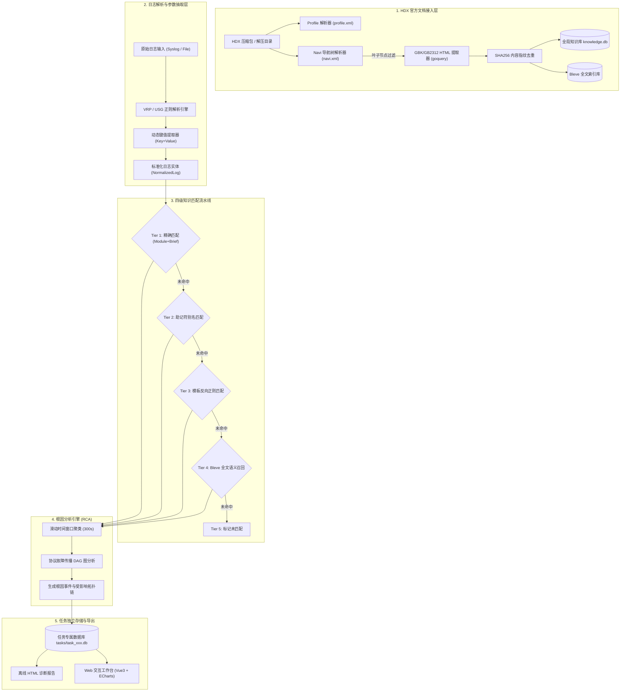

<div align="center">

# 🚀 LogAuditorGo (华为网络设备日志智能分析平台)

**基于华为官方产品文档知识库的离线高性能网络故障智能分析、日志语义解析与根因诊断（RCA）平台**

[](https://golang.org)
[](https://vuejs.org/)
[](https://vitejs.dev/)
[](https://github.com/blevesearch/bleve)
[](https://modernc.org/sqlite)
[](LICENSE)

[功能特性](#-核心特性) • [系统架构](#-系统架构) • [快速开始](#-快速开始) • [使用指南](#-使用指南) • [API 规范](#-restful-api-规范) • [目录结构](#-项目工程目录) • [演进路线](#-演进路线图)

</div>

---

## 📖 项目背景与定位

### 痛点与挑战
主流通用日志分析平台（如 ELK、Graylog、Splunk、Loki 等）长于海量日志的集中采集、时序存储与检索可视化，但缺乏针对华为网络设备（CloudEngine 交换机、HiSecEngine 防火墙、NetEngine 路由器等）的**深度语义解析**、**设备动态参数结构化抽取**以及与**官方故障知识库的智能关联**能力。

网络工程师在排查故障时，往往需要在日志平台检索出报错后，再手动翻阅数千页的华为官方 Hedex/HDX 文档、排查手册，或者凭借个人经验排查，效率低下且技术门槛极高。

### 平台定位
**LogAuditorGo** 是一款专为华为网络设备打造的离线智能故障分析平台：
1. **自动化解构华为官方 HDX 产品文档**：流式解析 `profile.xml` 与 `navi.xml` 目录树，提取 Log Reference 与 Alarm/Trap Reference，利用 SHA-256 内容哈希实现多版本全局去重与知识库构建；
2. **高精度日志解析**：纯 Go 原生解析华为 VRP Syslog、USG 安全日志，自动抽取插槽卡号及 `Key=Value` 动态参数；
3. **四级置信度知识匹配引擎**：通过精确匹配、助记符别名容错、模板反向正则、Bleve 全文语义检索实现知识库与日志流的毫秒级对齐；
4. **根因分析（RCA）引擎**：基于时间滑动窗口与内置网络协议故障传播有向无环图（DAG），自动聚合衍生告警并推导根因事件；
5. **任务级存储物理隔离**：单次审计任务独立生成 SQLite 数据库，支持灵活归档、导出与无残留清理。

---

## 🌟 核心特性

- ⚡ **高性能 & 纯 Go 原生**：零 CGO 依赖，单二进制分发，低内存占用，秒级启动与极速解析。
- 🔒 **100% 纯离线运行**：面向高安全等级的生产内网、隔离机房，不依赖任何外部云端服务与公网连接。
- 📚 **日志与告警（Syslog/Trap）双模知识库**：
  - **Log Reference**：日志标识、日志模板、含义解释、动态参数、可能原因、处理步骤。
  - **Alarm Reference**：Trap OID、MIB 模块、告警级别、系统影响、可能原因、处理步骤。
- 🗂️ **多产品线与多版本无缝适配 & 去重**：
  - 支持 CloudEngine 数据中心交换机、HiSecEngine 防火墙等多产品系列。
  - 知识条目内容哈希去重，支持智能版本回退（同型号最新版本 $\rightarrow$ 同系列相近版本 $\rightarrow$ 全局通用协议知识）。
- 🔍 **Bleve 原生嵌入式全文检索**：支持多字段布尔检索、中文关键词分词匹配、错误代码秒级召回。
- 🧩 **高精度四级匹配流水线**：
  - **Tier 1 (EXACT, 1.0)**：模块与助记符完全一致。
  - **Tier 2 (MNEMONIC, 0.90)**：助记符别名与常见状态后缀（`_active`, `_fail`, `_down` 等）模糊匹配。
  - **Tier 3 (TEMPLATE, 0.80)**：参数占位符转义与日志正文模板反向匹配。
  - **Tier 4 (BLEVE, 0.50~0.75)**：基于 Bleve 倒排索引的语义打分召回。
- 🌐 **根因分析（RCA）引擎**：
  - **重叠滑动窗口聚类**（300s 窗口 + 60s 边缘重叠）避免硬边界切断跨窗口的长因果链。
  - 内置常见网络故障传播链（物理链路中断 $\rightarrow$ BFD Down $\rightarrow$ 路由邻居中断 $\rightarrow$ 路由撤销；光模块异常 $\rightarrow$ CRC 错包 $\rightarrow$ 端口 Down；RADIUS 故障 $\rightarrow$ 认证失败 $\rightarrow$ 批量下线；M-LAG Peerlink $\rightarrow$ DAD $\rightarrow$ 端口隔离等）。
  - 基于倒排索引的 O(k·m) BFS 推导 + 全局排他认领，保证每条日志归属唯一根因。
- 🖥️ **多设备协同关联分析**：
  - 设备维度建模与按 Hostname 自动归属（仅绑定未归属记录，不覆盖人工设置）。
  - 多设备联合时间线（按绝对时间升序归并）、跨设备影响面报告。
  - 单设备时间线与 CSV / HTML 报表导出。
- 💼 **任务管理与多文件导入**：支持空任务创建、多文件批量追加导入、覆盖/跳过/重命名同名文件冲突策略、服务端本地目录直读导入。
- 📤 **分类流式导出**：CSV 按行游标流式写出、JSON 流式数组拼装、HTML 指标 SQL 聚合 + 明细采样，内存占用恒定，不再受导出条数上限掣肘。
- 📊 **长任务全流程进度追踪**：SSE 实时推送 + HTTP 指数退避轮询双通道，支持一键终止长任务；弹窗关闭后转入后台继续追踪，顶栏常驻任务徽标可随时调回。
- 🔐 **离线安全基线**：导入类接口路径白名单守卫（`storage.allowed_roots`）、文件系统浏览接口限定本机回环、5xx 响应脱敏并附 `X-Request-ID`、跨域来源白名单校验。
- 🖥️ **现代 Web 工作台**：基于 Vue 3 + Element Plus + ECharts 构建的三栏式日志审计工作台与动态 RCA 拓扑图，前端状态由 Pinia 统一管理。

---

## 🏗️ 系统架构



---

## 🛠️ 技术选型

### 后端技术栈
| 组件 / 模块 | 技术选型 | 说明 |
| :--- | :--- | :--- |
| **开发语言** | Go 1.26+ | 高性能、原生轻量并发、跨平台编译 |
| **Web 框架** | Gin (`github.com/gin-gonic/gin`) | 高性能 RESTful 路由与中间件 |
| **ORM** | GORM (`gorm.io/gorm`) | 对象关系映射与事务支持 |
| **嵌入式数据库** | modernc.org/sqlite (`glebarez/sqlite`) | 纯 Go 原生 SQLite 驱动，无 CGO 依赖 |
| **全文搜索引擎** | Bleve v2 (`github.com/blevesearch/bleve/v2`) | 纯 Go 原生倒排索引，支持中文与多字段组合检索 |
| **HTML/DOM 解析** | goquery (`github.com/PuerkitoBio/goquery`) | 类 jQuery 语法的 CSS 选择器解析 |
| **编码转换** | `golang.org/x/text` | GBK / GB2312 转 UTF-8 转码支持 |
| **配置管理** | Viper (`github.com/spf13/viper`) | YAML 配置文件解析与默认值回退 |
| **日志记录** | Zap (`go.uber.org/zap`) | 高性能结构化分级日志 |

### 前端技术栈
| 组件 / 模块 | 技术选型 | 说明 |
| :--- | :--- | :--- |
| **前端框架** | Vue 3 (Composition API, `<script setup>`) | 响应式组件化开发 |
| **构建工具** | Vite 6+ | 极速冷启动与热更新构建 |
| **UI 组件库** | Element Plus (`element-plus`) | 企业级中后台 UI 库 |
| **图表可视化** | ECharts 5+ (`echarts`) | 级别分布图、时序趋势图、RCA 拓扑图 |
| **路由与状态** | Vue Router 4 + Pinia | 单页路由管理与全局状态响应 |

---

## 🚀 快速开始

### 方式一：直接运行预编译版本 (Windows)
1. 进入 `build/` 目录；
2. 运行 `LogAuditorGo.exe`；
3. 打开浏览器访问：`http://localhost:8080`。

### 方式二：从源码编译构建

#### 1. 环境准备
- **Go**: 1.26+ 安装并配置好 `GOPATH` / `GOROOT`
- **Node.js**: 18.0+ & **npm**: 9.0+

#### 2. 克隆项目
```bash
git clone <repository_url>
cd LogAuditorGo
```

#### 3. 构建前端并打包为纯单二进制（推荐）

##### Windows 环境：
直接运行根目录下的 `build.bat` 脚本，将自动完成前端构建并将 `web/dist` 通过 Go `embed.FS` 嵌入二进制：
```cmd
build.bat
```

##### Linux / macOS 环境：
```bash
chmod +x build.sh
./build.sh
```

##### 手动逐步构建：
```bash
# 1. 编译前端
cd web
npm install
npm run build
cd ..

# 2. 编译 Go 纯单二进制（会自动将 web/dist 嵌入可执行文件中）
go build -ldflags="-s -w" -o build/LogAuditorGo.exe cmd/LogAuditorGo/main.go
```
> 💡 **说明**：通过 Go 标准库 `embed.FS` 机制，前端 Vite 构建产物已被完整嵌入 `LogAuditorGo.exe` 中，生成的可执行文件为**真正的独立单二进制文件**，可直接拷贝至任意机器或目录独立运行，无需携带额外的 `web/` 或前端文件。

#### 4. 访问系统
服务默认监听 `8080` 端口，打开浏览器访问：
```text
http://localhost:8080
```

---

## 💻 使用指南

### 1. 导入华为 HDX 产品文档
1. 进入 **「文档管理」** 页面；
2. **方式 A（本地解压目录导入）**：输入服务器本地存放 HDX 文档的绝对路径（如包含 `profile.xml` 的目录，或其上级总目录），点击「开始导入」；
3. **方式 B（ZIP 压缩包上传）**：直接上传 `.zip` 或 `.hdx` 文件，系统自动完成解包、XML 导航树扫描、HTML 字段提取、去重与 Bleve 索引构建；
4. 导入完成后，可在 **「知识库中心」** 检索验证已解析的日志参考与告警参考。

### 2. 创建日志审计任务
1. 进入 **「历史任务」** 或 **「日志审计工作台」**；
2. 点击「新建审计任务」；
3. 选择适配的设备类型（如 `CloudEngine`、`USG Firewall` 等）；
4. 上传待分析的 `.log` / `.txt` 日志文件，或直接粘贴日志文本；
5. 点击提交，系统自动启动多级知识匹配与 RCA 根因拓扑分析。

### 3. 三栏式审计与诊断排查
- **左栏（日志流与多维过滤）**：支持按严重级别（Emergency ~ Informational）、模块（BGP, IFNET, AAA, OSPF...）、主机名、关键词、时间范围及匹配状态快速筛选；
- **中栏（结构化报文详情）**：查看标准化时间戳、插槽卡号、事件简名及自动抽取的 `Key=Value` 动态参数字典；
- **右栏（官方知识库与诊断建议）**：展示匹配置信度、官方日志含义、可能原因、恢复步骤与推荐排查命令；
- **RCA 根因拓扑视图**：可视化查看故障传播链（例如：物理链路中断 $\rightarrow$ BFD Down $\rightarrow$ BGP 邻居断开）。

### 4. 多设备协同关联分析
1. 在工作台进入多设备视图，通过 **「设备管理」** 添加设备（名称 / Hostname / 型号 / 角色）；
2. 使用 **「自动归属」** 按日志 Hostname 批量绑定（仅绑定尚未归属的记录，不会覆盖人工设置）；
3. 在 **联合时间线** 中勾选设备与模块，按绝对时间升序查看跨设备事件流；
4. **「协同报告」** 给出跨设备影响面汇总，支持导出 HTML 报表与时间线 CSV。

### 5. 长任务进度追踪与终止
- 导入 / 重分析 / 文档导入 / 索引重建均会弹出全流程阶段进度窗口，优先走 SSE 实时推送，网络受限时自动降级为指数退避轮询；
- 点击 **「后台运行」** 或直接关闭弹窗，任务会在后台继续执行，完成后推送系统通知；
- 顶栏常驻 **「运行中任务」** 徽标（旋转图标 + 数量），点击即可随时调回进度窗口；
- 需要中止时点击 **「终止任务」**，服务端会在下一个阶段检查点停止并清理临时状态。

### 6. 导出诊断报告
- 在审计工作台点击 **「导出报告」**，支持 `HTML`（指标聚合 + 明细采样）、`JSON`（流式拼装）与 `CSV`（游标逐行流式写出）三种形态；
- 报告头部明确标注采样范围与时间跨度（由 SQL 聚合得出，而非前若干条截断推算）。

### 7. 知识库索引维护
- 进入 **「系统设置」** 可查看索引健康状态（索引文档数与数据库记录数是否一致）；
- 当索引出现漂移时点击 **「重建索引」**，系统在临时目录全量重建后原子替换，重建期间不影响现有检索。

---

## ⚙️ 配置文件说明

默认配置文件位于 `LogAuditorGoData/config.yaml`（首次启动时会自动生成默认模板）：

```yaml
server:
  port: 8080        # HTTP 服务监听端口
  mode: debug       # 运行模式: debug (调试模式) 或 release (生产模式)

storage:
  data_dir: "LogAuditorGoData"                          # 默认数据根目录
  knowledge_db: "LogAuditorGoData/knowledge.db"         # 全局知识库 SQLite 路径
  bleve_index: "LogAuditorGoData/bleve/knowledge.bleve"  # Bleve 全文检索索引目录
  task_dir: "LogAuditorGoData/tasks"                    # 任务专属 SQLite 存储目录
  upload_dir: "LogAuditorGoData/uploads"                # 临时文件上传目录
  # 导入类接口允许读取的服务端根目录白名单（安全加固，可选）
  # 留空 = 不限制（本地单机工具默认行为）；配置后，任何跳出这些根目录的路径都会被拒绝并返回 403
  allowed_roots:
    - "D:/logs"
    - "D:/hdx"

log:
  level: info       # 日志级别: debug, info, warn, error
  format: console   # 日志格式: console (控制台彩色) 或 json (结构化 JSON)
  dir: "LogAuditorGoData/log"  # 日志存放目录
  max_size_mb: 1024            # 日志最大保留总大小 (MB)
  max_days: 180                # 日志最大保留天数
```

> 🛡️ **安全提示**：`storage.allowed_roots` 留空时行为与旧版本一致（不限制）。若在多用户环境或需要限制读取范围，请显式配置该白名单，服务启动时会校验并忽略无效的目录项。

---

## 📡 RESTful API 规范

### 1. 系统与文档管理
| 方法 | 路径 | 描述 |
| :--- | :--- | :--- |
| `GET` | `/api/v1/system/stats` | 获取全局统计数据（文档总数、知识总数、任务总数等） |
| `POST` | `/api/v1/documents/import-dir` | 指定本地目录导入 HDX 产品文档 |
| `POST` | `/api/v1/documents/upload` | 上传 HDX 压缩包并自动解压导入 |
| `GET` | `/api/v1/documents` | 获取已导入文档列表及元数据 |
| `DELETE` | `/api/v1/documents/:id` | 删除指定文档及其版本映射 |

### 2. 知识库检索
| 方法 | 路径 | 描述 |
| :--- | :--- | :--- |
| `GET` | `/api/v1/knowledge/search` | 全文与多字段组合检索（支持 `keyword`, `module`, `entry_type`, `severity`, `page` 等参数） |
| `GET` | `/api/v1/knowledge/:id` | 获取单条知识详情（含跨版本适用映射） |
| `GET` | `/api/v1/system/knowledge-index/status` | 查询 Bleve 索引健康状态与文档数量一致性 |
| `POST` | `/api/v1/knowledge/reindex` | 触发索引物理重建（默认异步，返回 `job_id` 供进度追踪） |

### 3. 任务审计与 RCA
| 方法 | 路径 | 描述 |
| :--- | :--- | :--- |
| `POST` | `/api/v1/tasks` | 创建审计任务（支持空任务、文本或服务端路径导入） |
| `GET` | `/api/v1/tasks` | 获取所有任务列表及状态 |
| `GET` | `/api/v1/tasks/:id` | 获取单个任务元信息 |
| `GET` | `/api/v1/tasks/:id/files` | 获取指定任务已导入的文件列表 |
| `POST` | `/api/v1/tasks/:id/import` | 向已有任务导入/追加日志文件（支持 `conflict_mode=overwrite/skip/rename`） |
| `GET` | `/api/v1/tasks/:id/logs` | 分页及多条件过滤查询任务日志与匹配结果 |
| `GET` | `/api/v1/tasks/:id/modules` | 获取任务内出现的模块清单（用于筛选下拉） |
| `POST` | `/api/v1/tasks/:id/reanalyze` | 重分析任务（批量回写匹配结果） |
| `GET` | `/api/v1/tasks/:id/rca` | 获取指定任务的 RCA 根因事件与受影响链路 |
| `GET` | `/api/v1/tasks/:id/export` | 导出任务报告（`format=html` / `json` / `csv`，流式生成） |
| `DELETE` | `/api/v1/tasks/:id` | 删除任务及对应的物理 SQLite 数据库文件 |

### 4. 设备与多设备协同分析
| 方法 | 路径 | 描述 |
| :--- | :--- | :--- |
| `POST` | `/api/v1/tasks/:id/devices` | 在任务下创建设备 |
| `GET` | `/api/v1/tasks/:id/devices` | 获取任务的设备列表 |
| `GET` | `/api/v1/tasks/:id/devices/:device_id` | 获取单个设备详情 |
| `PUT` | `/api/v1/tasks/:id/devices/:device_id` | 更新设备（字段白名单 DTO，禁止裸 map 直写） |
| `DELETE` | `/api/v1/tasks/:id/devices/:device_id` | 删除设备（解绑日志与删除设备同事务） |
| `POST` | `/api/v1/tasks/:id/devices/:device_id/import` | 向指定设备导入日志 |
| `POST` | `/api/v1/tasks/:id/devices/auto-assign` | 按 Hostname 自动归属未绑定日志 |
| `POST` | `/api/v1/tasks/:id/multi-device/logs` | 多设备联合日志查询与分页 |
| `POST` | `/api/v1/tasks/:id/multi-device/timeline` | 多设备联合时间线 |
| `POST` | `/api/v1/tasks/:id/multi-device/report` | 多设备协同影响面报告 |
| `GET` | `/api/v1/tasks/:id/multi-device/export` | 导出多设备报表（`html` / `csv`） |

### 5. 进度追踪与文件系统浏览
| 方法 | 路径 | 描述 |
| :--- | :--- | :--- |
| `GET` | `/api/v1/progress/:job_id` | 查询长任务进度快照（HTTP 轮询通道） |
| `GET` | `/api/v1/progress/:job_id/stream` | 订阅长任务进度（SSE 实时推送通道） |
| `DELETE` | `/api/v1/progress/:job_id` | 终止正在运行的长任务 |
| `GET` | `/api/v1/fs/roots` | 获取服务端可选根目录与快捷方式（**仅本机回环可访问**） |
| `GET` | `/api/v1/fs/browse` | 分页浏览服务端目录（支持扩展名过滤与关键字筛选） |
| `POST` | `/api/v1/fs/stat` | 批量查询路径元信息 |

> 🔒 `/api/v1/fs/*` 全部经 `RequireLoopback()` 中间件限定为本机回环访问；导入类接口的路径另经 `storage.allowed_roots` 白名单守卫校验。

---

## 📂 项目工程目录

```text
LogAuditorGo/
├── cmd/
│   └── LogAuditorGo/
│       ├── main.go                     # 程序主入口（初始化配置、DB、索引、业务引擎并启动 Web）
│       └── server_test.go              # 服务集成与路由测试
├── internal/
│   ├── api/                            # HTTP API 路由与控制器
│   │   ├── document_handler.go         # 文档导入与上传处理
│   │   ├── knowledge_handler.go        # 知识库检索、详情与索引重建处理
│   │   ├── task_handler.go             # 任务生命周期、设备与多设备查询处理
│   │   ├── stats_handler.go            # 仪表盘统计处理（带缓存与主动失效）
│   │   ├── fs_handler.go               # 服务端本地文件系统只读浏览
│   │   ├── progress_handler.go         # 长任务进度查询/SSE/终止
│   │   ├── enrichment.go               # 日志富化与知识装配
│   │   ├── middleware.go               # RequestID、错误脱敏、回环校验中间件
│   │   ├── response.go                 # 统一 API 返回结构封装
│   │   └── router.go                   # Gin 路由与中间件装配
│   ├── config/                         # 系统配置解析 (Viper)
│   ├── fsx/                            # 路径安全守卫
│   │   └── guard.go                    # 白名单根目录校验 (SecurePathGuard)
│   ├── enrich/                         # 日志富化流水线
│   ├── hdx/                            # HDX 文档解构引擎
│   │   ├── extractor.go                # 文档目录扫描与 profile.xml 解析
│   │   ├── navigator.go                # navi.xml 导航树递归与叶子过滤
│   │   ├── html_parser.go              # goquery HTML 日志/告警字段抽取
│   │   └── charset.go                  # GBK/GB2312 自动转码支持
│   ├── knowledge/                      # 知识库服务与去重逻辑
│   │   ├── deduplicator.go             # SHA256 指纹计算与版本映射
│   │   ├── reindex.go                  # Bleve 索引物理重建与原子热替换
│   │   └── service.go                  # 知识库 CRUD、多版本回退与删除纳管
│   ├── logparser/                      # 华为日志解析引擎
│   │   ├── parser.go                   # 解析器统一接口与注册表
│   │   ├── vrp_parser.go               # 华为 VRP Syslog 正则解析器
│   │   ├── sec_parser.go               # USG 安全日志解析器
│   │   ├── param_extractor.go          # Key=Value 动态参数抽取
│   │   └── time_parser.go              # 多格式时间戳标准化
│   ├── matcher/                        # 四级知识匹配流水线
│   │   ├── engine.go                   # 精确/助记符/模板/Bleve 匹配调度器
│   │   └── scoring.go                  # 置信度评分模型
│   ├── model/                          # 全局领域数据模型
│   │   ├── document.go                 # 文档实体
│   │   ├── knowledge.go                # 知识库与版本映射实体
│   │   ├── log.go                      # 标准化日志实体与任务存储记录
│   │   ├── rca.go                      # 根因事件与影响链路模型
│   │   └── task.go                     # 任务元信息与文件模型
│   ├── rootcause/                      # 根因分析 (RCA) 引擎
│   │   ├── engine.go                   # 重叠窗口聚类 + 倒排 BFS 推导与置信度评分
│   │   ├── topology_dag.go             # 网络协议故障传播 DAG 规则库（含环检测）
│   │   └── cluster.go                  # 重叠滑动窗口时序聚类
│   ├── search/                         # Bleve 全文搜索引擎
│   │   ├── bleve_indexer.go            # 倒排索引构建、分词与组合检索
│   │   └── rebuild.go                  # 索引重建底座（临时目录构建 + 原子替换）
│   ├── storage/                        # SQLite 存储管理 (GORM)
│   │   ├── knowledge_db.go             # 全局知识库连接与迁移
│   │   └── task_db.go                  # 任务库引用计数连接池、驱逐与删除
│   ├── summary/                        # 日志语义摘要引擎
│   │   ├── engine.go                   # 摘要编排与调度
│   │   ├── kb_summarizer.go            # 基于知识库的事件摘要生成
│   │   └── alias_groups.go             # 模块/助记符别名分档
│   └── task/                           # 任务业务层
│       ├── service.go                  # 任务编排、设备与多设备业务
│       ├── import_pipeline.go          # 导入流水线：并发解析与分批落库
│       ├── import_prepare.go           # 导入前置：流式扫描、解码与设备嗅探
│       ├── reanalyze_update.go         # 重分析批量回写（CASE WHEN 批量 UPDATE）
│       ├── report_aggregate.go         # 报告指标 SQL 预聚合
│       ├── conclusion.go               # 结论文案数据驱动生成
│       ├── exporter.go                 # HTML / JSON / CSV 流式导出
│       └── templates/                  # 外置 HTML 报告模板 (go:embed)
├── pkg/
│   ├── logger/                         # Zap 日志工具库（含按大小/天数轮转）
│   ├── progress/                       # 长任务进度追踪器（支持 context 级联取消）
│   └── cache/                          # 轻量带 TTL 的内存缓存
├── web/                                # Vue 3 前端工程
│   ├── src/
│   │   ├── api/                        # Axios HTTP 请求封装（差异化超时 + 取消支持）
│   │   ├── views/                      # 页面视图 (Dashboard, Tasks, AuditWorkbench, KnowledgeCenter, Documents, Settings, NotFound)
│   │   ├── components/                 # 业务组件 (RcaGraph / RcaCenter / ImportProgressModal / ServerPathPicker / MultiDevice* / DeviceManager)
│   │   ├── stores/                     # Pinia 状态层 (task / filter / progress)
│   │   ├── composables/                # 复用逻辑 (useRequest 请求竞态守卫)
│   │   ├── plugins/                    # 按需引入 (echarts 按需注册 / 图标按需注册)
│   │   ├── router/                     # 路由配置（含 404 兜底）
│   │   ├── App.vue                     # 布局与顶栏"运行中任务"徽标
│   │   └── main.js
│   ├── package.json
│   └── vite.config.js                  # 分包策略、相对路径 base、体积告警阈值
├── docs/                               # 架构与审计文档
│   ├── 代码审计报告.md
│   └── 审计问题修复方案.md
├── build/                              # 编译输出目录
├── go.mod
└── go.sum
```

---

## 🧪 自动化测试

项目内置了完备的单元测试与集成测试：

```bash
# 运行全量测试套件
go test ./... -count=1

# 运行指定模块测试 (如 RCA 根因分析模块)
go test -v ./internal/rootcause/...

# 运行知识匹配测试
go test -v ./internal/matcher/...

# 竞态检测（需本机安装 gcc 并开启 CGO）
CGO_ENABLED=1 go test ./... -race -count=1

# 静态检查
go vet ./...

# 前端构建校验
cd web && npm run build
```

已覆盖的关键回归用例：

| 测试文件 | 覆盖内容 |
| :--- | :--- |
| `internal/logparser/time_parser_regression_test.go` | 多格式时间戳与时区解析边界 |
| `internal/logparser/variant_test.go` / `export_variant_test.go` | 华为变体日志（severity 0、缺省 type、多行粘包） |
| `internal/logparser/param_extractor_test.go` | Key=Value 空值、空格、中文键名、同名键 |
| `internal/matcher/export_test.go` | Tier1 软短路降级与版本分档打分 |
| `internal/rootcause/rca_regression_test.go` | 重叠窗口聚类、跨窗口链路完整性与排他认领 |
| `internal/task/task_test.go` | 导入流水线、冲突策略与任务删除生命周期 |
| `internal/api/api_test.go` | 路由装配、中间件与统一响应契约 |

---

## 🗺️ 演进路线图

- [x] **Phase 1: MVP 核心构建**
  - [x] HDX 文档解包与 XML/HTML 解析引擎
  - [x] 知识库 GORM 建模与 SHA256 去重存储
  - [x] Bleve v2 全文检索与中文组合查询
  - [x] 华为 VRP Syslog / USG 高精正则解析器与动态参数提取
  - [x] 四级知识匹配流水线与置信度评分算法
  - [x] Vue 3 前端三栏工作台与基础 API 联调
  - [x] 任务级 SQLite 存储物理隔离与追加导入
- [x] **Phase 2: 根因分析与生产增强**
  - [x] 基于滑动窗口与网络协议 DAG 的 RCA 根因推导
  - [x] ECharts 动态根因拓扑图可视化
  - [x] 任务离线 HTML 诊断报告一键导出
- [x] **Phase 2.5: 工程化加固（已完成）**
  - [x] 导入流水线拆分与分批事务落库
  - [x] 任务库引用计数连接池，Windows 下删除无句柄残留
  - [x] 解析引擎 Tier1 软短路降级与 KV 抽取容错
  - [x] RCA 重叠滑动窗口聚类与倒排 BFS 推导
  - [x] Bleve 索引物理重建与原子热替换
  - [x] 长任务进度追踪、后台运行与一键终止
  - [x] 分类流式导出（CSV / JSON / HTML）
  - [x] 路径白名单守卫、5xx 脱敏与 RequestID 链路追踪
  - [x] 前端 Pinia 状态层、请求竞态守卫与虚拟滚动
- [ ] **Phase 3: 智能化与大模型扩展（规划中）**
  - [ ] 预留标准 LLM / RAG 诊断 Prompt 上下文组装器
  - [ ] 支持对接私有化/本地大模型（DeepSeek、Qwen、Ollama 等）进行流式故障处置建议生成
  - [ ] 支持更多厂商（H3C、Cisco、Juniper）日志格式与知识扩展

---

## 📄 开源许可证

本项目基于 [MIT License](LICENSE) 开源发布。
