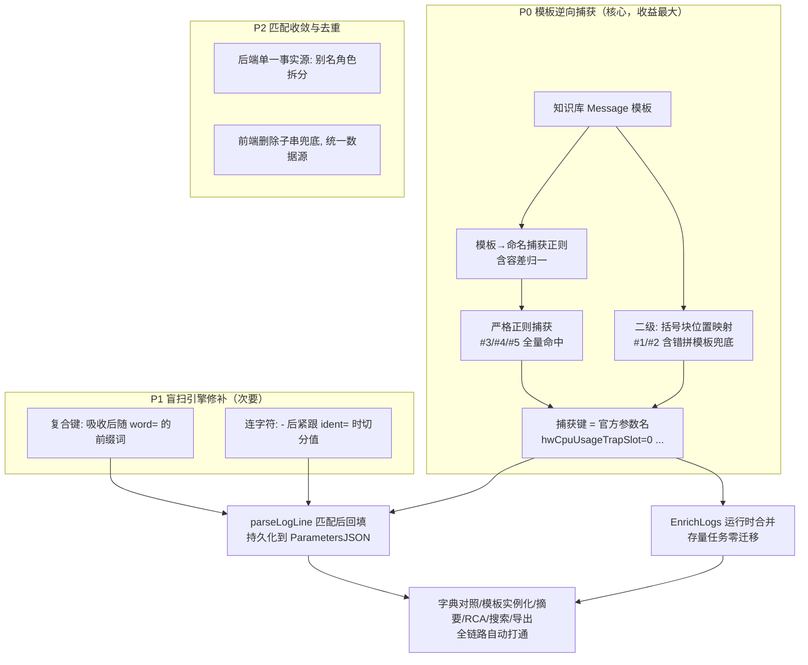

# 变量提取与官方参数捕获修复方案

> 依据：`docs/提取变量失败.txt` 五条报文的失败现象，结合
> `internal/logparser/param_extractor.go`、`internal/task/import_pipeline.go`、
> `internal/enrich/enrich.go`、`internal/enrich/service.go`、`internal/matcher/engine.go`、
> `internal/summary/alias_groups.go`、`web/src/views/AuditWorkbench.vue` 的代码走读。
>
> 结论：盲扫提取层 3 项缺陷属实；官方捕获层的核心矛盾是"官方参数命名体系（MIB
> 节点名/驼峰名）与现场键名（含空格复合键、自然语言）完全断层"。修复主线不是
> "别名扩容让现场键凑官方名"，而是 **官方模板反哺提取（Template-Driven
> Capture）**：以官方参数名作为捕获键，让下游精确匹配全链路自动打通。

---

## 1. 根因定案（对原分析的确认、纠偏与补充）

### 1.1 属实的缺陷

| # | 缺陷 | 证据位置 | 影响 |
|---|------|----------|------|
| D1 | 复合键名被截断：`isKeyChar` 不认空格，`scanKVPairs` 遇"前导词 + 空格 + 真键"时直接抛弃前导词 | `param_extractor.go:124-149, 281-287` | `slot id=0`/`CPU id=0` 双双退化为 `id` 且同值去重，槽位/CPU 上下文彻底丢失 |
| D2 | 连字符不作分隔：`scanValue` 遇 `-` 不截断（虽有空格后 `Key=` 检测兜底，但 `0x0-alarmID` 中 `-` 紧贴键名，检测不到） | `param_extractor.go:196-207` | `CID=0x0-alarmID=0x00f103b4-clearType=service_resume` 中 `alarmID` 被吞入 CID 值（值退化为 `0x0-alarmID`），`alarmID`/`clearType` 未成独立键值对 |
| D3 | 仅支持 `Key=Value`：正文无 `=` 即返回空 | `param_extractor.go:26-34` | 报文 #4/#5 正文 0 参数 |
| D4 | 官方参数名（`hwCpuUsageTrapSlot` 等）与现场键（`type`/`id`/`usage`）无映射通道 | `enrich.go:106-115`、`AuditWorkbench.vue:1408-1414` | 字典对照全"未捕获" |
| D5 | 模板实例化无逆向提取：占位符只能被动等键名撞上 | `enrich.go:133-165`、`AuditWorkbench.vue:1217-1256` | 模板占位符原样保留 |
| D6 | 字典比对无别名容错：`slotId` vs `Slot`、`dropReason` vs `reason` 判未捕获 | `AuditWorkbench.vue:1408-1420` | #3 四参数全灭 |

### 1.2 对原分析的纠偏

1. **报文 #3 `CPU=0` "碰巧注入"的机制**：外层命中条件是 `dName === normK`
   （占位符名与官方参数名一致），**不是** `dDesc.includes(normK)`（"CPU号。"不含
   "cpuid"）；随后内层遍历提取参数时，因说明文本含英文子串 "cpu" 才取到值。
   结论（碰巧、不可靠）成立，机制归因修正。
2. **D2 机制勘误（代码走读复核）**：`scanValue` 并非"只认 `, ; ( )` 终止"——
   199-207 行在空格后检测到 `Key=` 结构（`looksLikeKeyAt`）时也会截断值。因此
   `CID=0x0-alarmID=...` 实际吞到 `0x0-alarmID` 为止（`-` 紧贴 `alarmID`，
   空格检测够不到），不是"整段吞入 CID"。**影响评估**：P1 连字符修补的改动面
   比初判更小；且 `looksLikeKeyAt` 的判定语义与 3.2.1 复合键吸收天然耦合，
   两处必须同步修改并保持语义一致（方案 3.2 已含此要求，维持不变）。
3. **行号勘误（前端）**："描述子串包含"兜底实际在 `findActualVal` 内的
   defs 循环（1235-1253 行），1408-1421 行的 `kbParamDefs` 本身只做
   精确/规范化匹配、无子串兜底。P2 前端收敛时删除操作应对准 1235-1253。
4. **D3 措辞留余量**："仅支持 `Key=Value`"对 `param_extractor.go` 成立，
   但 `ParseLine` 的 parser 分派中个别 parser 可能支持冒号格式，实施 P1 前
   先确认各 parser 的分隔符覆盖，避免以偏概全。
5. **"知识库精准匹配模板"表述不严谨**：Tier1 EXACT 是 module+brief 命中；
   `matchTemplate` 因 `(?i)^全文$` 锚定 + 模板含 `FWD/4/XXX:` 头前缀而正文不含，
   对这批日志几乎必然失配，只是扣 0.25 后仍 ≥ 0.60（`MinTier1Confidence`）被放行。
   即现有校验是"宽松放行"，不是模板对齐成功。
3. **别名池扩容方案有隐藏反例**：`summary.AliasGroups` 的 `component` 组把
   `slot` 与 `cpuid` 混在同一语义角色，按组匹配会产生 slot 值注入 `cpuId`
   占位符的跨语义误配。别名只能作兜底，且必须先拆分角色。

### 1.3 原分析遗漏的关键事实

1. **matcher 已有"模板→正则"基础设施**：`placeholderMaskRegex` +
   `regexCache`(LRU) + `matchTemplate`（engine.go:513-555）。逆向捕获是把
   布尔匹配升级为命名捕获组，非从零建设。
2. **官方模板存在错拼**：#1/#2 模板写 `threashold`，现场日志是 `threshold`。
   严格"模板→正则"必然整体失配，需二级策略（见 3.1.3 位置映射）。
3. **流水线时序**：参数提取在 `parseLogLine` 中先于知识库匹配执行
   （import_pipeline.go:253 → 270），模板捕获只能插在匹配之后；存量任务
   需要 enrich 阶段运行时合并或 ReanalyzeTask。
4. **前后端双实现漂移**：模板渲染/参数对照在后端（`RenderMessageTemplate`/
   `EnrichParameters`）与前端（`renderedTemplateHtml`/`kbParamDefs`）各一份，
   前端 `aliasGroups`（AuditWorkbench.vue:1206-1215）是后端的残缺硬拷贝；
   且 `kbParamDefs` 只用 `parsedParameters`，`renderedTemplateHtml` 却融合了
   `enrichedParameters`，数据源不一致。只改前端，报告导出/CLI 出口仍失败。
5. **前端第三层"描述子串包含"兜底是误配隐患**：任何官方描述含 "IP" 即可
   吸走任意 ip 类参数（`dDesc.includes(pk)` 双向子串），应删除。

---

## 2. 修复方案总览



**设计原则**：捕获产出的键直接使用官方参数名，使 `EnrichParameters`、
`kbParamDefs`、`RenderMessageTemplate`、`renderedTemplateHtml` 的既有
exact/规范化匹配路径**无需改动**即全部命中；别名池降级为第三级兜底；
前后端渲染收敛到后端单一事实源。

---

## 3. 详细设计

### 3.1 P0：模板逆向捕获（新文件 `internal/summary/template_capture.go`）

#### 3.1.1 入口

```go
// CaptureTemplateParams 用知识库消息模板反向提取正文参数。
// 返回键 = 模板占位符名（即官方参数名），值 = 现场实际值。
// 严格正则失败时自动降级到括号块位置映射。
func CaptureTemplateParams(template, messageBody string) map[string]string
```

#### 3.1.2 一级策略：严格模板正则（覆盖 #3/#4/#5）

复用 matcher 的 `placeholderMaskRegex` 思路，构建带命名捕获组的正则：

1. **剥模板头**：`^\S+/\d/[A-Za-z0-9_\-]+:\s*`（如 `FWD/4/SESSCTRLEND: `），
   正文 MessageBody 不含该头，不剥则必然失配。
2. **逐段构建**：
   - 字面量段：`regexp.QuoteMeta` 后做容差归一——
     连续空白 → `\s+`；`=` → `\s*=\s*`（模板 `cpu id = [x]` vs 现场
     `CPU id=0`）；整体加 `(?i)`（模板小写 `cpu` vs 现场大写 `CPU`）。
   - 占位符段（`[name]`/`<name>`/`{name}`）→ `(?P<name>...)`，值模式按
     **后邻字面量首字符**选择：
     - 后邻是 `,` `;` `)` 或结尾 → `[^,;)]*?`（逗号/括号定界，天然适配
       括号 KV 块，#3 的 `Drop reason=TTL exceed packets discarded` 含空格不截断）；
     - 后邻是 `%` 等紧贴字面量 → `.*?` 非贪婪 + 该字面量收口（#5 的
       `from 98% to 1%`）；
     - 默认 → `.*?`。
3. **不锚定**：正文含 `CID=...;` / `Service=...;` 前导元数据段（模板没有），
   用 `FindStringSubmatch` 子串搜索，禁止 `^...$`（这是现有 `matchTemplate`
   与本需求的本质区别：它做布尔放行，我们做定位提取）。
4. **值清洗**：`TrimSpace`；键名取占位符原文（`slot-id`、`hwEntitySlotID`
   保持原样，`NormalizeKey` 归一化比较交给下游）。

```go
// #5 示例（示意）
// 模板: The CPU usage on SPU [hwEntitySlotID] CPU [hwEntityCpuID] ...
// 正则: (?i)The\s+CPU\s+usage\s+on\s+SPU\s+(?P<hwEntitySlotID>[^,;)]*?)\s+CPU\s+(?P<hwEntityCpuID>...)
// 命中: hwEntitySlotID=0, hwEntityCpuID=0, ...
```

#### 3.1.3 二级策略：括号块位置映射（覆盖 #1/#2，兼容官方模板错拼）

#1/#2 官方模板把 `threshold` 错拼为 `threashold`，一级正则**必然整体失配**。
降级策略：

1. 提取正文最外层括号 KV 块（复用 `paramBlockRegex`），按 `,` 切出 N 个
   `key=value` 项（键取 `=` 左侧原文，如 `forwarding type`）；
2. 提取模板中的括号块，按 `,` 切出 N 个含占位符的项；
3. 若**两侧项数相等**且逐项"模板项的字面量词集 ⊇ 正文项的键词集"（如
   `slot id = [hwCpuUsageTrapSlot]` 的词集 {slot,id} ⊇ 正文 {slot,id}；
   `threashold = [hwCpuUsageThreashold]` 与 `threshold` 允许 1 个编辑距离），
   则按位置映射：第 i 个正文值 → 第 i 个模板占位符名；
4. （评审补充）**值格式弱校验**：位置映射再加第四重门槛——映射值与相邻字面量
   语义/类型一致性弱校验。如 #1/#2 中 usage/threshold 期望值均为数字
   （usage=97、threshold=81），若正文对应项的值与该期望类型明显不符（如为空、
   为纯标点），则放弃本次位置映射整体结果（宁可不捕获，不可错位捕获）。
5. 命中结果标记 `provenance: positional`（供 UI/日志区分置信层级）。

无括号块或项数不等时返回空，交由 P1 盲扫 + P2 别名兜底。

#### 3.1.4 正则缓存

以 `template` 全文为键建 `LRU`（复用 `pkg/cache.NewLRUCache`——泛型实现，
位于 `pkg/cache/lru.go:26` 而非 `internal/cache`，容量 ≥ 512，
与 matcher `regexCache` 同构但独立实例，避免跨包耦合）。编译一次，
百万行导入下摊销为零。

#### 3.1.5 两个插入点（同一函数，双保险）

| 插入点 | 位置 | 作用 |
|--------|------|------|
| A. 导入/重分析 | `import_pipeline.go parseLogLine`：`Match` 成功且 `k.Message != ""` 时，`CaptureTemplateParams(k.Message, norm.MessageBody)` 合并进 `norm.Parameters`，随 ParametersJSON **持久化** | 新任务全链路（搜索/RCA/导出）可用捕获参数 |
| B. 富化 | `enrich/service.go EnrichLogs`：`rawParams` 解析后、`EnrichParameters`/`RenderMessageTemplate` 之前做同样的捕获合并 | **存量任务零迁移**，上线即生效 |

合并策略：捕获键（官方参数名）与盲扫键冲突时**以捕获值为准**（官方命名
权威性更高，如 `hwCpuUsageTrapSlot` 覆盖盲扫的畸形键）；两个官方名之间
沿用 `putParam` 的"同键异值合并 JSON 数组"语义。

### 3.2 P1：盲扫引擎修补（`param_extractor.go`）

服务于**未命中知识库**的场景（无模板可反哺），原则：宁可保守不可误吞。

#### 3.2.1 复合键吸收（修 D1）

`scanKVPairs` 读键时：读到词 `w1` 后遇空格，跳过空格若后续是
`w2...=`（即 `looksLikeKeyAt` 成立），则把 `w1 w2` 整体作为键继续扩展，
直到不再满足吸收条件后由既有逻辑判定 `=`。

- `forwarding type=1` → 键 `forwarding type` ✓
- `The CPU usage exceeds` → `usage` 后随 `exceeds`（非 `=` 结构），不吸收，
  各词照旧被抛弃，**不会**把普通英文句子误吞成键 ✓
- `slot id=0` / `CPU id=0` → 键 `slot id` / `CPU id`，天然去歧义 ✓

同步修改 `looksLikeKeyAt`（其判定语义需与键扫描一致，否则值截断与键吸收
行为会互相打架）。

#### 3.2.2 连字符切分（修 D2）

`scanValue` 普通值扫描遇 `-` 时：仅当 `-` 后文本在**下一个 `,`/`;`/边界内**
匹配 `ident=`（`ident` 为合理键名字符集）时，值在 `-` 处截断，扫描点回退到
`-` 之后，让 `alarmID`/`clearType` 成为独立键值对。

- `CID=0x0-alarmID=0x00f103b4;` → `CID=0x0`、`alarmID=0x00f103b4` ✓
- `...-clearType=service_resume;` → 追加 `clearType=service_resume` ✓
- 含连字符的正常值（`LACP 1-2`、UUID、日期）因 `-` 后无 `ident=` 结构不受影响 ✓

### 3.3 P2：匹配与渲染收敛（前后端统一）

1. **别名角色拆分**（`summary/alias_groups.go`）：从 `component` 组拆出
   `slot`（slot/slotid/slotno/槽位号）与 `cpu`（cpu/cpuid/cpuno/CPU号）
   独立角色；新增 `reason`/`count` 等角色覆盖 `dropReason↔reason`、
   `dropCount↔count`。**注意**：调整 `component` 组会影响
   `ExtractCoreContextParams` 摘要输出，需同步回归。
2. **后端 `EnrichParameters` 增加第三级角色别名匹配**（exact → normalized →
   role-alias），并把匹配到的官方描述回填 `EnrichedParameter`。
3. **前端收敛**：
   - `kbParamDefs` 数据源从仅 `parsedParameters` 改为与 `renderedTemplateHtml`
     一致（融合后端 `enriched_parameters`，其中已含官方名捕获值）；
   - **删除** `findActualVal` 第三层"描述子串包含"兜底（双向 includes 误配
     隐患，#3 的 `CPU=0` 碰巧命中即源于此）；
   - 删除前端硬拷贝 `aliasGroups`（1206-1215 行），别名判定统一走后端
     `enriched_parameters` 下发结果，消除双源漂移。
4. **`RenderMessageTemplate`（Go）与前端渲染语义对齐**：exact →
   normalized → 角色别名 →（新增）捕获键已天然 exact，报告导出与 Web 展示
   结果一致。

---

## 4. 验收标准（对应五条报文）

| 报文 | 捕获策略 | 预期官方参数捕获 | 预期盲扫新增 |
|------|----------|------------------|--------------|
| #1 active | 位置映射 | hwCpuUsageTrapType=1, hwCpuUsageTrapSlot=0, hwCpuUsageTrapCpu=0, hwCpuUsageCurrentUsage=97, hwCpuUsageThreashold=90（字典 5/5，模板 5/5 注入） | `CID=0x0`、`alarmID=0x00f103b4`、复合键 `forwarding type`/`slot id`/`CPU id`/`current CPU usage` |
| #2 clear | 位置映射 | 同上，usage=55、threshold=81（5/5） | 追加 `clearType=service_resume` |
| #3 DROP_LOG | 严格正则 | slotId=0, cpuId=0, dropReason=TTL exceed packets discarded, dropCount=28298（4/4，模板 4/4 注入） | 复合键 `Drop reason`/`Drop count` |
| #4 SESSCTRLEND | 严格正则 | slot-id=0, cpu-id=0, cpu-usage=100, permitted-packets-num=0, blocked-packets-num=0（5/5） | —（正文无可提取键值对，全部依赖模板捕获） |
| #5 SuddenChange | 严格正则 | hwEntitySlotID=0, hwEntityCpuID=0, hwEntityPreviousValue=98, hwEntityCurrentValue=1, hwEntityChangeValue=97, hwEntityChangeValueThreshold=40（6/6） | `CID=0x814f042e`、`alarmID=0x00f10334` |

**回归红线**：

- 既有单测全绿：`internal/api/enrichment_test.go`、`internal/enrich/enrich_test.go`、
  `internal/matcher/matcher_test.go`、`internal/logparser` 全部用例；
- 复合键/连字符改动不产生新误吞（用普通英文叙述句、含连字符值做反例断言）；
- `component` 角色拆分后 `ExtractCoreContextParams` 摘要输出 diff 审查——
  拆分**前**先对一批代表性任务跑摘要并保存快照基线，作为 diff 对照，
  否则 diff 审查无参照（评审补充）；
- 存量任务（不重跑）在前端字典/模板处即见捕获值（验证插入点 B）。

---

## 5. 测试计划

1. **单测**（新增 `template_capture_test.go`）：
   - 五条报文逐条断言捕获结果（上表）；
   - 模板头剥离、`\s*=\s*` 容差、`(?i)`、`%` 收口、无锚定定位（前导
     `Service=...;` 不干扰）；
   - 位置映射的项数不等/词集不匹配/编辑距离 >1 拒绝；
   - 正则缓存命中路径。
2. **盲扫单测**（扩展 `param_extractor` 用例）：复合键吸收正反例、连字符
   切分正反例（UUID/日期/LACP 反例）。
3. **端到端**：导入 `提取变量失败.txt` 原始五条，检查 Web 字典对照、模板
   实例化、事件摘要；导出报告比对一致性。
4. **性能**：百万行级导入基准，验证正则缓存摊销（捕获仅对命中知识库且
   `Message != ""` 的日志执行）。

---

## 6. 风险与边界

| 风险 | 缓解 |
|------|------|
| 位置映射误配（模板与正文括号块结构偶合但语义错位） | 项数相等 + 词集包含 + 编辑距离 ≤1 三重门槛；结果标记 provenance 供审计 |
| 值模式过宽（`.*?` 跨句子吞并） | 优先 `,`/`;`/`)`/`%` 定界模式；模板项含句号的场景在测试集中显式覆盖 |
| 复合键吸收误吞正常句子 | 吸收条件严格限定"后随词 + 可选空格 + `=`"；反例用例守卫 |
| 连字符切分误伤 | 仅当 `-` 后为 `ident=` 结构才切；反例（UUID/日期/LACP）守卫 |
| 别名角色拆分影响存量摘要 | 摘要输出 diff 审查 + 单测覆盖 `ExtractCoreContextParams` |
| 模板含正则超长/病态输入 | 键名 rune 上限沿用 `maxParamKeyRunes`；正则编译失败降级返回空并记 Warn |
| 存量任务无 ParametersJSON 捕获值 | 插入点 B（EnrichLogs 运行时合并）零迁移；需要搜索/导出可捕获参数时走 ReanalyzeTask |

---

## 7. 实施顺序与工作量

| 阶段 | 内容 | 预估 |
|------|------|------|
| 1 | `template_capture.go` + 单测（一级严格正则 + 二级位置映射 + 缓存） | 1.5 人日 |
| 2 | 插入点 A（parseLogLine）+ 插入点 B（EnrichLogs）+ 集成测试 | 0.5 人日 |
| 3 | 盲扫修补（复合键 + 连字符）+ 正反例单测 | 1 人日 |
| 4 | 别名角色拆分 + `EnrichParameters` 三级匹配 + 摘要回归 | 0.5 人日 |
| 5 | 前端收敛（kbParamDefs 数据源、删子串兜底、删硬拷贝别名） | 0.5 人日 |
| 6 | 端到端验收 + 报告导出一致性 + 性能基准 | 0.5 人日 |

总计约 4.5 人日。阶段 1+2 即可让五条报文的"官方参数字典"与"模板实例化"
全部转绿（P0 独立交付）；阶段 3 起为增量增强。
