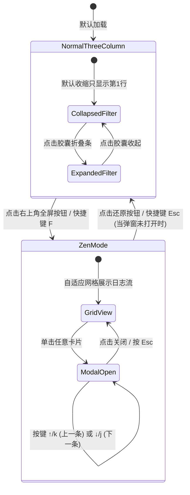
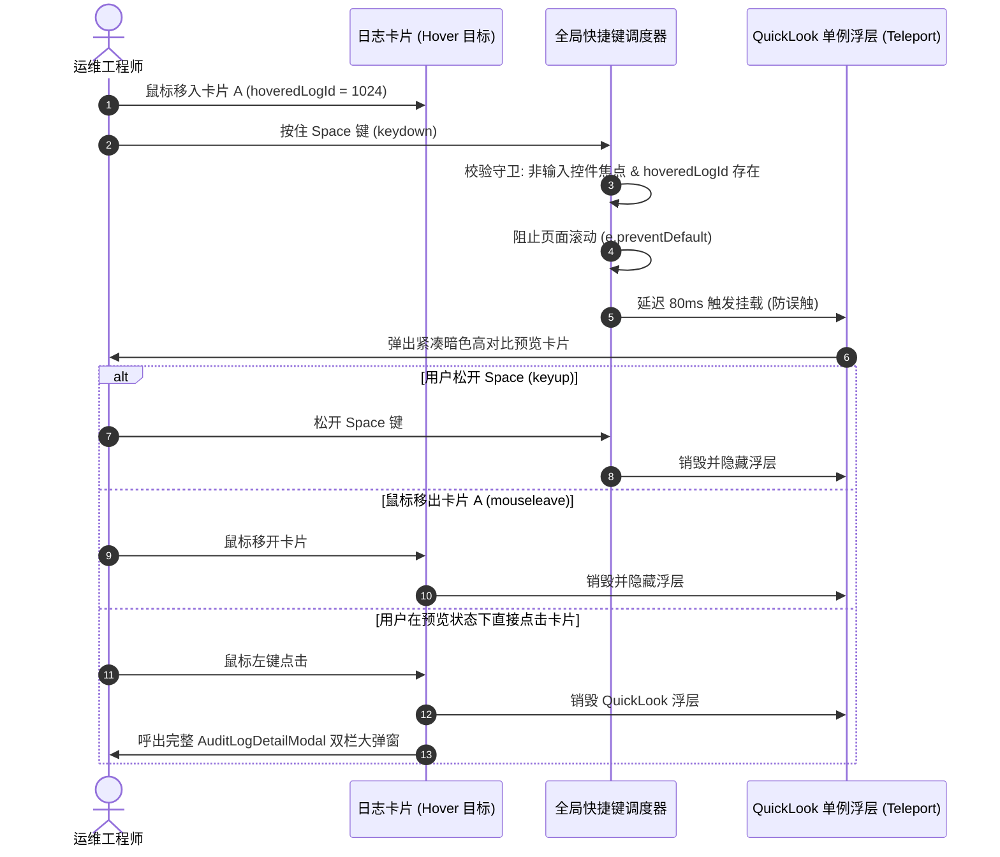

# 日志审计工作台前端布局重构与沉浸式体验设计方案

> **状态**：规划设计定稿（评审就绪）  
> **面向模块**：前端工作台（`web/src/views/AuditWorkbench.vue` 及配套组件）  
> **关联文档**：[`docs/高级筛选与标签系统设计方案.md`](file:///d:/Document/GO/LogAuditorGo/docs/高级筛选与标签系统设计方案.md)、[`docs/架构与模块说明书.md`](file:///d:/Document/GO/LogAuditorGo/docs/架构与模块说明书.md)（第 7 章查询链路与工作台交互）、[`web/src/stores/filter.js`](file:///d:/Document/GO/LogAuditorGo/web/src/stores/filter.js)

---

## 一、背景与问题诊断

在网络设备日志审计场景中，运维工程师的核心工作流是：**高频检索 → 快速浏览时序日志流 → 定位异常点 → 深度查阅报文结构与官方处理指南**。

经过对现有 `AuditWorkbench.vue` 经典三栏布局（左栏日志流 28%、中栏结构化解析 36%、右栏知识库与 RCA 36%）的实测与人机工程学评估，当前界面存在以下关键瓶颈：

```
+---------------------------------------------------------------------------------------------------------+
|                                  当前经典三栏布局存在的问题全景诊断                                      |
+---------------------------------------------------------------------------------------------------------+
| [左栏 28% ~450px 宽]                     | [中栏 36%] 报文解析        | [右栏 36%] 知识库指导      |
|                                         |                            |                            |
| 1. 垂直空间严重挤压：                    |                            |                            |
|    筛选面板纵向占用 6 整行（~260px 高），  |                            |                            |
|    导致 1080p 屏幕下日志列表首屏仅能显示  |                            |                            |
|    5 ~ 6 条日志，需频繁滚轮翻页。        |                            |                            |
|                                         |                            |                            |
| 2. 控件语义割裂：                        |                            |                            |
|    "排序方式"在第 2 行，"起始/截止时间"    |                            |                            |
|    在第 5 行，同属时序维度的控件被拆散。   |                            |                            |
|                                         |                            |                            |
| 3. 大屏利用率低下与信息吞吐量瓶颈：      |                            |                            |
|    用户在只想集中排查大批量日志时，中栏和  |                            |                            |
|    右栏常态霸占 72% 的屏幕空间，大宽屏    |                            |                            |
|    下无法在一个屏幕中纵览全局日志动态。    |                            |                            |
+---------------------------------------------------------------------------------------------------------+
```

### 核心用户诉求：
1. **时序控制归一**：将时间排序选项、起始时间、截止时间三个控件合并至同一行，平均占用 1/3 列宽，形成时序闭环。
2. **属性筛选收缩**：将其余分散筛选项（设备、级别、匹配状态、标签等）如法炮制进行网格化紧凑排版，大幅压减行数与行高。
3. **渐进式折叠与空间释放**：在筛选框底部与日志计数条之间增加悬浮折叠把手，默认收缩仅显示第一行输入检索，一键切换全量展开/收起。
4. **全屏沉浸式工作台（Zen Mode）**：搜索组件右上角新增全屏切换按钮，点击后全屏隐藏中右两栏解析，日志流卡片以**多列自适应网格（Adaptive Density Grid）**铺开（1920×1080 下 3 列、2560×1440 下 4 列），同屏吞吐量提升约 3 倍（1080p 下约 18 ~ 21 条）。
5. **全屏居中弹窗解析与连贯排查**：在全屏状态下，单击某条日志弹出居中双栏模态框，完整呈现原本中栏和右栏的全部结构化与知识库解析。

---

## 二、人体工程学（Ergonomics）与现代化设计理念

本方案不仅仅是简单的样式重排，而是基于**现代交互工程学、人眼视觉动线与认知负荷理论**进行深度重塑：

### 2.1 菲茨定律（Fitts's Law）与视线动线优化
- **时序聚焦（Temporal Cohesion）**：人脑在建立排查假说时，通常先确定“时间轴”，再设定“属性”。将【排序方式】、【起始时间】、【截止时间】并列一行，符合单向视觉扫描路径，避免光标上下大幅度往返移动。
- **操作热区与渐进式呈现（Progressive Disclosure）**：
  - 80% 的日常检索场景中，用户只需关键字匹配即可完成初筛。
  - 默认收起多余选项，仅保留第 1 行搜索栏，将垂直高度从 260px 缩减至 42px，**释放出超过 200px 的黄金垂直视域，首屏日志可见数量增加 80%**。

### 2.2 认知负荷控制与过滤态感知（Active Filter Awareness）
- **痛点**：传统抽屉/折叠面板收起后，用户容易遗忘自己勾选了“严重级别 <= 2”或“时间段”，导致面对稀少日志时产生“系统数据缺失”的错误感知。
- **现代化改良**：
  - 折叠把手上设计**活跃过滤项徽标（Active Filter Badge）**与微型状态胶囊；
  - 即使在收缩状态下，也能直观感知背景生效的过滤条件数量（如“已生效 3 项条件”），并支持一键重置。

### 2.3 多列卡片排版密度（Adaptive Density Grid）
- **最佳阅读宽度（Optimal Line Length）**：
  - 现代排版人机工程学表明，人眼扫视文本的最佳行宽为 **50 ~ 75 字符（约 480px ~ 640px）**。过宽易串行，过窄易产生过频换行。
  - 在 1920×1080 分辨率下，全屏宽度约 1900px，采用 **3 列网格**时，单列卡片宽度恰好为 **610px ~ 620px**，处于黄金舒适阅读区间。
  - **行宽约束直接决定响应式断点（见 4.3 节）**：列宽跌破 480px 下沿即自动减列、超出 640px 上沿一定幅度即自动增列，任何分辨率下卡片都锁定在舒适阅读区间，而非用固定列数硬套所有屏幕。
  - 单屏同屏展示日志由原先的 6 条提升至 **18 ~ 21 条（约 3 倍）**，2560×1440 下自动升为 4 列可达 **24 ~ 32 条**，大幅缩短运维排查大事件的时间窗。
  - **口径说明（评审修正）**：按 1080p 全屏垂直可用高度 830 ~ 900px（扣除浏览器 chrome、导航、搜索行、计数条与内边距）、卡片基准高 105 ~ 115px + 12px 间距测算，每列 6 ~ 7 行 × 3 列 ≈ 18 ~ 21 条。初稿宣称的“24 ~ 28 条（提升 400%）”经算术复核无法成立（需卡片压至 ≤ 96px 且垂直空间 100% 利用），本方案统一按实测口径修正，避免不可达的验收指标流入实施阶段。

### 2.4 键盘穿梭与沉浸式无障碍排查（Keyboard-driven Workflow）
- 全屏弹窗不仅是一个展示容器，更内置了针对运维工程师极客习惯的**键盘轮播流**：
  - `↑` / `k`：上一条日志解析；
  - `↓` / `j`：下一条日志解析；
  - `Esc`：关闭当前最上层浮层——优先级为「解析弹窗 > QuickLook 预览 > 退出全屏」，逐层返回，避免一键误退全屏；
  - `f`：一键切换工作台全屏（`Shift + f`：联动浏览器物理全屏，见建议 4）。
  - **快捷键守卫（Key Guard，评审补充）**：所有单键快捷键仅在焦点不处于 `input` / `textarea` / `select` / `contenteditable` 时生效，并忽略按键长按连发（`event.repeat === true` 时跳过），杜绝在搜索框内输入 `j` / `k` / `f` 字符时误触发视图切换。
  - 实现“双手不离键盘”的无缝连续审计。

---

## 三、功能蓝图与架构演进

### 3.1 布局架构对比图

```
===========================================================================================================
【模式 A：经典三栏协同模式 (Default 3-Column Split Mode)】
===========================================================================================================
+------------------------------------+----------------------------------+----------------------------------+
| 左栏：紧凑筛选 + 日志流 (28%)      | 中栏：报文结构化解析 (36%)       | 右栏：官方指导与 RCA 拓扑 (36%)   |
| +--------------------------------+ | +------------------------------+ | +------------------------------+ |
| | [行1: 搜索框 / 重置 / ⛶全屏]   | | | 原始报文 / 语义解析摘要      | | 官方解释 / 产生原因 / 处理步骤 | |
| | (折叠收缩态默认仅显示此行)     | | 核心结构化字段 (描述列表)      | 现场参数动态注入开关           | |
| |................................| | 动态提取变量与文档说明卡片     | RCA 因果拓扑关联树             | |
| | [行2: 排序 1/3 | 起始 1/3 | 截止] | 官方消息模板实例化             |                                | |
| | [行3: 设备 1/3 | 级别 1/3 | 状态] | 关联根因事件预警               |                                | |
| | [行4: 标签多选 | 全部/任一 | 管理] |                                |                                | |
| | [--- ⌃ 收起筛选 (已生效2项) ---] | |                                |                                | |
| +--------------------------------+ |                                |                                | |
| | 共 12,480 条日志   [⚡高级筛选] | |                                |                                | |
| +--------------------------------+ |                                |                                | |
| | [Lv.2 BGP/ROUTER_DOWN] 单列流  | |                                |                                | |
| | [Lv.4 IFNET/LINK_DOWN]         | |                                |                                | |
| | [Lv.6 OSPF/NBR_CHANGE]         | |                                |                                | |
| +--------------------------------+ | +------------------------------+ | +------------------------------+ |
+------------------------------------+----------------------------------+----------------------------------+

===========================================================================================================
【模式 B：沉浸式多列全屏模式 (Zen Mode / Focus Density Grid)】
- 中栏与右栏自动隐藏，左栏占满 100% 视口；
- 日志流展开为自适应卡片矩阵（1080p 3 列 / 2K 4 列，列宽恒定于最佳阅读区间），单屏同屏吞吐量提升约 3 倍；
- 点击任意日志卡片，居中调起高保真双栏深度解析弹窗。
===========================================================================================================
+---------------------------------------------------------------------------------------------------------+
| [行1: 搜索报文/模块/简名...                                 ] [重置] [🏷标签] [⚡高级筛选] [❐ 退出全屏] |
| [--- ⌄ 展开完整筛选条件 (已生效: 级别<=2 | 2026-10-10) -------------------------------------------------] |
| 共 12,480 条日志 (按时间正序排列)                                                      每页 50 条 [第 1 页] |
+-----------------------------------+-----------------------------------+---------------------------------+
| 【列 1】                          | 【列 2】                          | 【列 3】                        |
| +-------------------------------+ | +-------------------------------+ | +-----------------------------+ |
| | Lv.2 BGP/PEER_BACK            | | | Lv.2 BGP/PEER_BACK            | | | Lv.1 SYS/CARD_FAIL          | |
| | BGP 对等体已断开连接          | | | BGP 对等体重连成功            | | | 槽位 3 板卡上报硬件异常   | |
| | 11:40:02 | Switch-A | Gigabit | | | 11:40:05 | Switch-A | Gigabit | | | 11:40:08 | Core-01 | Slot-3  | |
| | [故障] [核心层]               | | | [自愈]                        | | | [硬件] [紧急]               | |
| +-------------------------------+ | +-------------------------------+ | +-----------------------------+ |
| | Lv.4 IFNET/LINK_DOWN          | | | Lv.4 IFNET/LINK_UP            | | | Lv.6 OSPF/NBR_CHANGE        | |
| | 接口 10GE1/0/1 物理状态 Down  | | | 接口 10GE1/0/1 物理状态 Up    | | | OSPF 邻居状态从 FULL 转 DOWN| |
| | 11:40:12 | Switch-B | Eth1/1  | | | 11:40:16 | Switch-B | Eth1/1  | | | 11:40:20 | Switch-A | VLAN10  | |
| +-------------------------------+ | +-------------------------------+ | +-----------------------------+ |
| | (以此类推，1080p 单屏可完整显示 18 ~ 21 条高信息量日志卡片...)                                       | |
+---------------------------------------------------------------------------------------------------------+
                                                     │
                                                     ▼ 单击任意卡片
+ - - - - - - - - - - - - - - - - - - - - - - - - - - - - - - - - - - - - - - - - - - - - - - - - - - - - +
: 【居中全屏解析弹窗 (AuditLogDetailModal.vue) - 宽 86vw / 高 82vh】                                      :
: 头部: [#2841] BGP/PEER_BACK (Lv.2)      [⬆ 上一条 (k)] [⬇ 下一条 (j)] [12/50]           [✕ 关闭 (Esc)] :
: ------------------------------------------------------------------------------------------------------- :
: [左侧 50%] 报文结构化解析                | [右侧 50%] 华为官方知识库与 RCA 根因联动                     :
: - 原始 Syslog 报文 (代码高亮块)          | - 含义解释 (Markdown 渲染)                                   :
: - 事件语义摘要 (蓝底高亮卡片)            | - 产生原因分析                                               :
: - 核心结构化字段 (Descriptions 表格)     | - 现场参数动态注入排查指导 (交互式排查步骤)                  :
: - 动态提取变量网格 (PeerIP, LocalPort...) | - RCA 因果溯源节点关系                                       :
+ - - - - - - - - - - - - - - - - - - - - - - - - - - - - - - - - - - - - - - - - - - - - - - - - - - - - +
```

---

## 四、详细交互与界面规范设计

### 4.1 筛选项目紧凑重构（满足需求 1 & 需求 2）

将原本垂直排布的 6 行筛选区域重新规划为精炼的 **4 行紧凑网格体系**（6 行 → 4 行，单行高度统一 32px，展开态总高约 170px，较原 260px 缩减约 35%；默认收起时仅 42px，与 §2.1 的空间释放论证保持一致）。初稿正文曾表述为“3 行网格体系”但布局图与模板实际为 4 行（标签组合行独立），三处口径不一，现统一为 **4 行**——450px 左栏宽度下若将标签多选强行并入行 3，单个控件将不足 110px，无法完整显示下拉文案：

#### 行 1：核心检索与操作常驻行（默认唯一可见行）
- **左侧**：`el-input` 关键字输入框（支持报文模糊搜索、模块简名匹配），`size="small"`，弹性伸缩 `flex: 1`。
- **中间**：`el-button` 重置按钮（当存在激活筛选时出现或高亮）。
- **右侧**：
  - `⚡ 高级筛选` 抽屉触发器（带激活条件计数角标）；
  - `⛶ 全屏/沉浸` 切换按钮（需求 4 核心入口，带 tooltip 提示“全屏沉浸审计，快捷键 F”）。

#### 行 2：时序与时间窗口闭环行（需求 1 核心实现）
三等分 Flex/Grid 布局，每列宽度严格占据 **33.33% (`flex: 1`)**，内部留白 `gap: 6px`。
数据流零改动（评审补充）：沿用现有 `currentSortOption` computed（映射 store 中 `sortBy` + `order` 双字段）与既有时间快捷项定义，本行仅做布局重排，不触碰查询参数语义：
1. **排序选择器 (`currentSortOption`)**：
   - 包含：`⏰ 时间正序 (从早到晚)`、`⏰ 时间倒序 (从新到旧)`、`📄 原始入库顺序`；
   - 窄屏紧凑优化：占位符精简为“排序方式”。
2. **起始时间选择器 (`filter.timeStart`)**：
   - `type="datetime"`，`format="YYYY-MM-DD HH:mm:ss"`，`value-format="YYYY-MM-DDTHH:mm:ssZ"`；
   - 带有常用快捷项（近 1 小时、近 6 小时、近 24 小时、今天）。
3. **截止时间选择器 (`filter.timeEnd`)**：
   - 与起始时间对齐，提供快捷预设与清空能力。

#### 行 3：属性筛选行（需求 2 核心实现）
三等分弹性布局（`flex: 1`），左栏 450px 窄宽下每控件约 140px，保证下拉文案完整可读：
- **设备筛选 (`filter.deviceId`)**：仅多设备任务（`taskDevices.length > 1`）下展示；**单设备任务自动整体隐藏**（单设备无筛选意义），隐藏后级别与状态控件自动扩展为各占 1/2。
- **级别过滤 (`filter.severity`)**：全部级别、<=2 紧急/告警、<=4 错误及以上、<=6 通知及以上（沿用现有选项文案）。
- **匹配状态 (`filter.matched`)**：全部、已匹配知识库、未匹配。

#### 行 4：标签组合行
- **标签多维筛选 (`filter.tagIds`)**：多选 `el-select`（`collapse-tags` + tooltip），弹性占满剩余宽度；
- **逻辑切换 (`filter.tagLogic`)**：复用现有 `toggleTagLogic`，选中 ≥ 2 个标签时出现「全部 / 任一」切换按钮（对应 AND / OR，P1-12）；
- **标签管理入口**：唤起已有 `TagManagerModal`，保持标签体系闭环。
- **评审修正说明**：初稿模板将标签塞入行 3 且丢失了逻辑切换与管理入口，与正文“整合为紧凑标签组合控件”的描述及布局图模式 A 的行 4 均不一致，此处一并补齐。

```html
<!-- 规划模板示意 -->
<div class="filter-panel" :class="{ 'is-collapsed': isFilterCollapsed }">
  <!-- 行 1: 始终常驻显示 -->
  <div class="filter-row filter-row-primary">
    <el-input
      v-model="filter.keyword"
      placeholder="搜索报文/模块/简名 (如 RM/ROUTE_DELETE)..."
      prefix-icon="Search"
      clearable
      size="small"
      class="keyword-input"
      @change="onFilterChange"
    />
    <el-button v-if="hasActiveFilter" size="small" type="info" plain @click="handleResetFilters">
      重置
    </el-button>
    <el-tooltip :content="isZenMode ? '退出全屏 (Esc)' : '全屏沉浸式工作台 (F)'" placement="bottom">
      <el-button
        size="small"
        :type="isZenMode ? 'primary' : 'default'"
        icon="FullScreen"
        class="fullscreen-toggle-btn"
        @click="toggleZenMode"
      />
    </el-tooltip>
    <!-- 注: 统一使用 FullScreen 图标, 激活态以 primary 高亮表达"当前已全屏";
         初稿的 CopyDocument 图标存在"复制文档"语义歧义, 已修正 -->
  </div>

  <!-- 折叠内容包裹容器 (由动画控制展开收缩) -->
  <div v-show="!isFilterCollapsed" class="filter-collapsible-wrapper">
    <!-- 行 2: 时间与排序三等分行 (需求 1) -->
    <div class="filter-row filter-row-time-triplet">
      <el-select v-model="currentSortOption" placeholder="排序方式" size="small" class="triplet-item" @change="onSortChange">
        <el-option label="⏰ 时间正序" value="time_asc" />
        <el-option label="⏰ 时间倒序" value="time_desc" />
        <el-option label="📄 原始入库顺序" value="id_asc" />
      </el-select>
      <el-date-picker
        v-model="filter.timeStart"
        type="datetime"
        placeholder="起始时间"
        size="small"
        class="triplet-item"
        format="YYYY-MM-DD HH:mm:ss"
        value-format="YYYY-MM-DDTHH:mm:ssZ"
        :shortcuts="startTimeShortcuts"
        clearable
        @change="onFilterChange"
      />
      <el-date-picker
        v-model="filter.timeEnd"
        type="datetime"
        placeholder="截止时间"
        size="small"
        class="triplet-item"
        format="YYYY-MM-DD HH:mm:ss"
        value-format="YYYY-MM-DDTHH:mm:ssZ"
        :shortcuts="endTimeShortcuts"
        clearable
        @change="onFilterChange"
      />
    </div>

    <!-- 行 3: 设备/级别/匹配状态行 (需求 2) -->
    <div class="filter-row filter-row-attributes">
      <el-select v-if="taskDevices.length > 1" v-model="filter.deviceId" placeholder="设备筛选" clearable size="small" class="attr-item" @change="onFilterChange">
        <el-option label="全部设备" :value="null" />
        <el-option v-for="d in taskDevices" :key="d.id" :label="`${d.device_name} (${d.log_count}条)`" :value="d.id" />
      </el-select>
      <el-select v-model="filter.severity" placeholder="级别过滤" clearable size="small" class="attr-item" @change="onFilterChange">
        <el-option label="全部级别" :value="null" />
        <el-option label="<=2 (紧急/告警)" :value="2" />
        <el-option label="<=4 (错误及以上)" :value="4" />
        <el-option label="<=6 (通知及以上)" :value="6" />
      </el-select>
      <el-select v-model="filter.matched" placeholder="匹配状态" clearable size="small" class="attr-item" @change="onFilterChange">
        <el-option label="全部状态" :value="null" />
        <el-option label="已匹配知识库" :value="true" />
        <el-option label="未匹配" :value="false" />
      </el-select>
    </div>

    <!-- 行 4: 标签筛选 + 逻辑切换 + 管理 -->
    <div class="filter-row filter-row-tags">
      <el-select
        v-model="filter.tagIds"
        multiple collapse-tags collapse-tags-tooltip clearable
        placeholder="🏷 按标签筛选" size="small" style="flex: 1;"
        @change="onFilterChange"
      >
        <el-option v-for="t in tagStore.tags" :key="t.id" :label="`${t.name} (${t.log_count || 0})`" :value="t.id" />
      </el-select>
      <el-button
        v-if="filter.tagIds && filter.tagIds.length > 1"
        size="small"
        :type="filter.tagLogic === 'all' ? 'primary' : 'default'"
        @click="toggleTagLogic"
      >
        {{ filter.tagLogic === 'all' ? '全部' : '任一' }}
      </el-button>
      <el-button size="small" @click="tagManagerVisible = true">管理</el-button>
    </div>
  </div>

  <!-- 需求 3: 底部悬浮展开/收缩控制条 -->
  <div class="filter-toggle-pill-bar" @click="toggleFilterCollapse">
    <div class="pill-handle">
      <el-icon><component :is="isFilterCollapsed ? 'ArrowDown' : 'ArrowUp'" /></el-icon>
      <span class="pill-label">{{ isFilterCollapsed ? '展开完整筛选' : '收起筛选' }}</span>
      <span v-if="isFilterCollapsed && hiddenActiveFilterCount > 0" class="pill-badge">
        {{ hiddenActiveFilterCount }} 项生效
      </span>
    </div>
  </div>
</div>
```

---

### 4.2 悬浮折叠交互与动效设计（满足需求 3）

1. **布局定位**：
   - 位于 `filter-panel` 最底部与 `log-stream-toolbar`（“共 XXX 条日志”）正上方；
   - 采用吸附居中排版，避免传统普通大按钮占用额外高度。
2. **视觉风格**：
   - 胶囊型药丸手柄（`border-radius: 9999px`，高度 18px，宽度 120px）；
   - 背景使用柔和的磨砂灰色或高光白底（`background: #f1f5f9; border: 1px solid #cbd5e1;`）；
   - Hover 时提供微妙的高亮微动效（`transform: translateY(1px); color: #0284c7;`）。
3. **收起状态下的上下文感知（人体工程学亮点）**：
   - 当用户在展开状态下设置了“级别 <= 2”和“起始时间”，随后收起面板时，胶囊条上动态显示小徽标：`已生效 2 项`；
   - 徽标计数仅统计「收起后不可见的过滤项」（`hiddenActiveFilterCount`），常驻第 1 行的关键字搜索不计入，避免重复表达；
   - 徽标与建议 1 的微型过滤胶囊是「兜底 ↔ 主表达」关系：胶囊渲染具体约束并支持单项移除，胶囊溢出受限时才以 `+N` 徽标汇总，二者不同屏重复渲染同一信息；
   - 彻底杜绝“面板收起后忘记自身过滤条件”导致的排查误判。
4. **展开/收起过渡动画**：
   - 采用 `max-height` 与 `opacity` 的复合贝塞尔曲线过渡（`transition: max-height 0.25s cubic-bezier(0.4, 0, 0.2, 1), opacity 0.2s ease`）；
   - `max-height` 必须使用贴合展开实际高度的具体上限（行 2 ~ 行 4 共 3 × 32px + 间距 ≈ 110px，取 `120px` 留余量），而非 `999px` 占位大值——后者会导致收起动效前半程“空转延迟”（评审补充）；
   - 展开顺滑无生硬跳变，收起干净利落。

---

### 4.3 全屏沉浸模式与自适应多列网格（满足需求 4）

1. **进入/退出全屏机制**：
   - 全屏切换按钮位于第一行搜索框右上角（图标统一为 `FullScreen`，激活态以 `primary` 高亮表达“当前已全屏”，见 4.1 模板注释）；
   - 支持全局快捷键：按下键盘 `f` 键切换全屏，按 `Esc` 退出全屏（Esc 遵循 2.4 节分层语义与快捷键守卫：输入焦点内不触发、忽略长按连发）。
2. **视图结构变化**：
   - 激活全屏（`isZenMode = true`）时：
     - `col-middle` 和 `col-right` 统一采用 `v-show="!isZenMode"` 隐藏（`v-show` 本质即 `display: none` 的封装，二者并列书写属冗余表述；选 `v-show` 而非 `v-if` 的理由：保留中右栏滚动位置与组件状态，退出全屏无需重建渲染树）；
     - `col-left` 的宽度从 `28%` **平滑过渡**扩展为 `100%`（`transition: width 0.2s ease`），避免“瞬间”跳变破坏空间连续感；
     - 日志流列表容器 `log-stream-list` 从 Flex 纵向单列变为 **CSS Grid 自适应多列矩阵**：
       ```css
       .workbench-container.zen-mode .log-stream-list {
         display: grid;
         /* 列宽下限 560px: 保证单列落在 480~640px 最佳阅读区间,
            auto-fill 让列数随视口宽度自动增减, 2K 宽屏自然收敛于 4 列 */
         grid-template-columns: repeat(auto-fill, minmax(560px, 1fr));
         gap: 12px;
         align-content: start;
         padding: 12px;
       }
       .workbench-container.zen-mode .log-card { min-width: 0; } /* 防止长报文内容撑破网格轨道 */
       ```
3. **断点容错（Responsive Graceful Degradation）**：
   - 采用 `auto-fill + minmax(560px, 1fr)` 后，断点由浏览器自动计算，无需手写媒体查询。各典型视口宽度下的预期列数（与 2.3 节“最佳行宽 480 ~ 640px”论证严格对齐）：
     - ≥ 2300px：**4 列**（单列 ~560 ~ 630px）——2560×1440（2K 宽屏）；
     - 1728 ~ 2299px：**3 列**（单列 ~560 ~ 700px）——1920×1080（主流全屏）；
     - 1156 ~ 1727px：**2 列**（单列 ~560 ~ 850px）——1366×768（笔记本）、窗口分屏；
     - < 1156px：**1 列**——窄窗口 / 平板巡检。
   - 2 列区间上沿单列宽可达 ~850px，超出最佳区间上限约 30%，属可接受范围；若需严格锁定行宽，可改用 `minmax(560px, 640px)` + `justify-content: center`，以列间留白换取行宽稳定；
   - **设计约束自查（评审修正）**：初稿“≥ 1200px 固定 3 列”会使 1366×768 笔记本下单列仅约 440px，跌破最佳行宽下沿、与 2.3 节论证自相矛盾，且回归用例还要求在该分辨率下按三列验收——固定断点方案已否决，改为上述自适应方案；
   - 保证在任何显示器或窗口分屏尺寸下均维持最佳视觉排版。
4. **网格卡片的人体工程学微调**：
   - 每张卡片左侧增加 **3px 严重度彩色指示竖条（Left Accent Strip）**：
     - Lv.0 / Lv.1 / Lv.2：紧急深红 (`#ef4444`)（Lv.0 对应 syslog `emergencies` 级，初稿色带从 Lv.1 起步属遗漏，已补齐）
     - Lv.3 / Lv.4：告警橙黄 (`#f59e0b`)
     - Lv.5 / Lv.6：通知蓝色 (`#3b82f6`)
     - Lv.7 / Comment：信息浅灰 (`#94a3b8`)
   - 运维工程师在密集卡片矩阵中快速扫视时，同色系竖条形成垂直色带引导，人眼余光即可快速锁定全部故障告警，显著降低扫视疲劳度。
5. **双模式排查上下文连续性（评审补充）**：
   - Zen Mode 下通过弹窗查看过的最后一条日志记录为「最近查看」；退出全屏恢复三栏时，中右栏自动联动该条日志，保证沉浸排查与深度解析之间的上下文无缝衔接，无需用户重新寻找。
6. **分页策略保持不变（评审补充）**：
   - Zen Mode 下沿用每页 50 条（约 2 ~ 3 屏滚动），不盲目放大 `page_size`：50 张卡片（含色条、标签等子元素）约 600+ DOM 节点，已接近无虚拟滚动方案的舒适渲染上限；后续若接入网格虚拟滚动，再评估提升至 100+。

---

### 4.4 居中全屏解析弹窗与穿梭审计（满足需求 5）

1. **触发时机**：
   - 在**普通模式**下：点击日志卡片仍然联动刷新中栏和右栏，保持习惯一致；
   - 在**全屏（Zen Mode）模式**下：点击任意日志卡片，立刻呼出居中大尺寸模态框 `AuditLogDetailModal.vue`。
2. **弹窗规格与布局**：
   - 尺寸：`width: 86vw; max-width: 1500px; height: 82vh;`；
   - 内部结构：采用精妙的 **50% : 50% 双栏并排分屏**：
     - **左栏**：完整继承并呈现原本中栏的结构化解析（原始 Syslog、事件语义解析摘要、核心结构化字段 Descriptions、动态提取变量与文档说明卡片、官方日志消息模板实例化）；
     - **右栏**：完整呈现原本右栏的华为官方知识库（含义解释、产生原因、现场参数动态注入排查指导）与 RCA 因果拓扑关联；
   - 内部自带独立滚动条，支持超长排查步骤的顺畅阅读；
   - 窄视口（< 1000px）下双栏自动退化为上下堆叠（上解析 / 下知识库），避免单栏行宽过窄不可读（评审补充）。
3. **人体工程学穿梭轮播流（Keyboard Carousel Navigation）**：
   - 弹窗顶部操作栏集成：
     - `[ ⬆ 上一条 (快捷键 ↑ / k) ]`
     - `[ ⬇ 下一条 (快捷键 ↓ / j) ]`
     - `[ 进度: 12 / 50 条 ]`
     - `[ ✕ 关闭 (Esc) ]`
   - 当弹窗处于打开状态时，运维人员按上下方向键即可直接在模态框内无缝切换当前页内的相邻日志，**完全无需频繁手动“关弹窗 → 点选新日志 → 开弹窗”**，极大减少了鼠标移动与点击次数。
4. **轮播边界与联动细节（评审补充）**：
   - **边界行为**：已处于本页第 1 条时「上一条」、最后一条时「下一条」按钮禁用并轻抖提示（`disabled + shake`），**不自动跨页加载**——避免页码、滚动位置与网格选中态三者联动复杂化，跨页浏览由用户返回网格操作分页完成；
   - **网格回显联动**：弹窗内切换日志时，背景网格中对应卡片同步高亮并 `scrollIntoView({ block: 'center' })`，关闭弹窗后视线可无缝落回当前浏览位置；
   - **右栏空态设计**：当该条日志未匹配知识库时，右栏 50% 区域显示结构化空态（「该日志暂未匹配知识库」+「去知识库添加」引导入口），杜绝大面积留白；
   - **快捷键守卫**：轮播快捷键遵循 2.4 节统一守卫规则（输入焦点内不触发、忽略长按连发）。

---

## 五、架构设计与代码拆分方案

为了避免 `AuditWorkbench.vue`（实测 2,726 行 / 约 95KB；初稿所写“2,925 行 / 97KB”与实际不符，已修正）进一步臃肿化，本方案严格遵循**高内聚、低耦合、逻辑分层拆分**原则，且每个实施阶段都伴随对应组件的拆出（见第七章），确保该文件行数只减不增：

```
web/src/
├── views/
│   └── AuditWorkbench.vue          # 主工作台（仅负责视图编排、布局状态与数据派发）
├── components/
│   ├── AuditFilterBar.vue          # [新] 紧凑型筛选面板（行1常驻检索、行2时序三等分、行3属性、行4标签组合、悬浮折叠把手）
│   ├── AuditLogCard.vue            # [新] 高性能日志卡片（支持单列/多列网格自适应、严重度条、标签）
│   ├── AuditLogDetailModal.vue     # [新] 全屏居中双栏解析弹窗（包含键盘上下轮播、完整中右栏内容）
│   ├── AdvancedFilterDrawer.vue    # 已有高级筛选抽屉
│   └── TagManagerModal.vue         # 已有标签管理弹窗
└── stores/
    ├── filter.js                   # 保持零改动（筛选条件与查询参数，不感知布局状态）
    └── workbenchUI.js              # [新] UI 布局偏好：isFilterCollapsed / isZenMode（见 5.1）
```

### 5.1 UI 布局偏好持久化（独立于 `filter.js`，评审修正）

> **否决初稿方案**：初稿计划把 `isFilterCollapsed` / `isZenMode` 直接塞进 `filter.js` 的 `defaults()`。经核对现有实现，`filter.js` 的 `resetFilters()` 执行 `filters.value = defaults()` **整体替换**——若 UI 状态混入其中，用户在沉浸模式下点击「重置」会被连带退出全屏、展开筛选面板，属于隐蔽的状态污染回归点；且布局偏好与“筛选条件”语义无关，混入会破坏该 store 的职责单一性（`toLogQueryBody`、持久化 watch 均不应感知布局状态）。

因此新建轻量 UI 偏好 store，与筛选数据彻底解耦：

```javascript
// web/src/stores/workbenchUI.js [新]
import { defineStore } from 'pinia'
import { ref, watch } from 'vue'

const STORAGE_KEY = 'logauditorgo:workbench-ui'

export const useWorkbenchUIStore = defineStore('workbenchUI', () => {
  const load = () => {
    const fallback = { isFilterCollapsed: true, isZenMode: false }
    try {
      return { ...fallback, ...JSON.parse(localStorage.getItem(STORAGE_KEY) || '{}') }
    } catch (e) {
      return fallback
    }
  }
  const ui = ref(load())
  watch(ui, (v) => {
    try { localStorage.setItem(STORAGE_KEY, JSON.stringify(v)) } catch (e) { /* 隐私模式忽略 */ }
  }, { deep: true })
  return { ui }
})
```

**要点**：
1. `filter.js` **零改动**（`resetFilters` / `toLogQueryBody` / 持久化逻辑均不感知布局状态）；
2. 独立持久化键 `logauditorgo:workbench-ui`，与筛选持久化键 `logauditorgo:workbench-filters` 天然隔离，互不串味；
3. `isZenMode` 随 localStorage 记忆恢复（刷新后停留在上次的视图模式），`isFilterCollapsed` 默认 `true`（收起），符合 2.1 节“渐进式呈现”原则。

### 5.2 全屏状态与弹窗联动状态机



> **Esc 语义分层（评审补充）**：弹窗打开时 `Esc` 仅关闭弹窗；QuickLook 预览激活时仅关闭预览；两者均未激活时才退出全屏。快捷键按「最上层浮层优先」在单一入口函数中分发，避免多处监听互相抢占。同时所有单键快捷键遵循 2.4 节守卫规则（输入焦点内不触发、忽略 `event.repeat`）。

---

### 六、深度改良建议详细工程设计（超越基础诉求的高价值创新）

在满足用户 5 项基础要求的前提下，结合大型电信网络与数通设备故障排查实战场景，对 **5 项现代化与人体工程学深度改良设计** 进行完整的工程级详细设计，涵盖组件结构、状态流转、CSS 规范与异常守卫。

---

### 6.1 建议 1 详细设计：微型过滤胶囊（Active Filter Chips）系统

#### 1. 挂载位置与布局规范
微型过滤胶囊条（`active-filter-chips-bar`）作为**过滤状态的第一表达窗口**，根据筛选栏折叠状态采用双模态挂载：
- **面板收起态 (`isFilterCollapsed === true`)**：
  - 挂载于第 1 行搜索栏下方与折叠胶囊把手上方之间，高度 `28px`，采用单行弹性横向流（`flex-wrap: nowrap; overflow-x: hidden; gap: 6px;`）；
  - 左侧常驻极简文案标签 `已生效条件:`（灰色，`font-size: 11px`）；
  - 若已生效胶囊总宽超出可用视宽，末尾自动展示 `+N` 溢出汇总胶囊，鼠标悬停于 `+N` 上通过 `el-popover` 浮层完整展示其余胶囊；
- **面板展开态 (`isFilterCollapsed === false`)**：
  - 胶囊栏自动隐退（`display: none`），此时完整的 4 行表单直接呈现，避免信息多处冗余。

```
+---------------------------------------------------------------------------------------------------------+
| [🔍 搜索报文/简名...                                                    ] [重置] [⚡高级] [⛶ 全屏]     |
| 已生效: [⏰ 11:00~11:30 ✕] [⚠️ 级别≤2 ✕] [🖥 Switch-A ✕] [🏷 核心故障 ✕] [+2项 ▾]                        |
| [------------------------------ ⌄ 展开完整筛选条件 ----------------------------------------------------] |
+---------------------------------------------------------------------------------------------------------+
```

#### 2. 条件映射契约与原子清除逻辑

| 筛选维度 | 触发条件 | Chip 渲染标签与图标 | Tooltip 悬浮提示文案 | 点击「✕」原子清除行为 |
| :--- | :--- | :--- | :--- | :--- |
| **时间区间** | `timeStart` 或 `timeEnd` 非空 | `⏰ [简写时间段] ✕`（如 `10:00~11:30`） | 完整 ISO 起止时间段 | `filter.timeStart = null; filter.timeEnd = null;` 触发刷新 |
| **设备筛选** | `deviceId` 且多设备 | `🖥 [设备别名] ✕` | `设备: [完整设备名] (包含 N 条日志)` | `filter.deviceId = null;` 触发刷新 |
| **严重级别** | `severity !== null` | `⚠️ 级别 ≤ [N] ✕` | `严重度过滤: Level [N] 及以上紧急告警` | `filter.severity = null;` 触发刷新 |
| **知识库状态**| `matched !== null` | `📚 [已匹配 / 未匹配] ✕` | 知识库命中状态筛选 | `filter.matched = null;` 触发刷新 |
| **标签筛选** | `tagIds.length > 0` | 单标签: `🏷 [标签名] ✕`<br>多标签: `🏷 [首标签] +N (AND/OR) ✕` | 列出全部选中标签名称及逻辑关系 | `filter.tagIds = [];` 触发刷新 |
| **非默认排序**| `currentSortOption !== 'time_asc'` | `↕ [时间倒序 / 入库顺序] ✕` | 排序规则偏离默认值提示 | 恢复 `currentSortOption = 'time_asc'` 触发刷新 |

#### 3. 胶囊组件模板与样式规范
```html
<div v-if="isFilterCollapsed && activeFilterChips.length > 0" class="active-filter-chips-bar">
  <span class="chips-label">已生效:</span>
  <div class="chips-list">
    <el-tag
      v-for="chip in visibleChips"
      :key="chip.key"
      size="small"
      closable
      :type="chip.tagType || 'info'"
      class="filter-chip-item"
      @close="removeSingleFilter(chip.key)"
    >
      <el-icon class="chip-icon"><component :is="chip.icon" /></el-icon>
      <span class="chip-text">{{ chip.label }}</span>
    </el-tag>
    <!-- 溢出项汇总 Popover -->
    <el-popover v-if="overflowChips.length > 0" trigger="hover" placement="bottom-start" width="auto">
      <template #reference>
        <el-tag size="small" type="info" class="filter-chip-item overflow-tag">+{{ overflowChips.length }}项 ▾</el-tag>
      </template>
      <div class="overflow-chips-popover">
        <el-tag
          v-for="chip in overflowChips"
          :key="chip.key"
          size="small"
          closable
          :type="chip.tagType || 'info'"
          style="margin: 3px;"
          @close="removeSingleFilter(chip.key)"
        >
          {{ chip.label }}
        </el-tag>
      </div>
    </el-popover>
  </div>
</div>
```

---

### 6.2 建议 2 详细设计：场景化时间区间对齐（Quick Range Presets）引擎

#### 1. 业务痛点与动态锚点（Anchor Timestamp）解析机制
数通审计的日志多为**离线导入的历史归档日志**（例如 2026-08-25 产生的网络割接日志）。若时间快捷预设使用前端原生 `new Date()`，生成的查询窗口将处于当前现实时间（2026-10-10），导致查询结果必然为 0 条。

因此必须建立**动态数据锚点引擎（Dynamic Anchor Engine）**：

```
                           +--------------------------------------------------+
                           |           动态时间锚点计算引擎                   |
                           +--------------------------------------------------+
                                     /                              \
                                    /                                \
           [场景 A: 故障扩散分析]  /                                  \  [场景 B: 闪断最新排查]
                                 v                                      v
                  当前日志列表中高亮聚焦日志                             当前任务库中最新日志
                      (selectedLog.timestamp)                             (taskMeta.latest_timestamp)
                                 │                                      │
            ┌────────────────────┴───────────────────┐                  │
            ▼                                        ▼                  ▼
     [向前 30 分钟]                            [向后 30 分钟]     [回溯 15 分钟]
   (T_selected - 30m)                       (T_selected + 30m)  (T_latest - 15m)
```

#### 2. 场景化时间预设规则定义

```javascript
// 时间预设快捷项生成器（注入在 el-date-picker 的 shortcuts 配置中）
export const buildTimeShortcuts = (context) => {
  const { latestLogTime, selectedLogTime } = context
  return [
    {
      text: '⚡ 闪断最新 (前15分钟)',
      value: () => {
        if (!latestLogTime) return null
        const end = new Date(latestLogTime)
        const start = new Date(end.getTime() - 15 * 60 * 1000)
        return [start, end]
      },
      disabled: !latestLogTime,
      tooltip: latestLogTime ? `以任务最新日志 (${formatTime(latestLogTime)}) 为准回溯 15m` : '任务暂无有效时间戳'
    },
    {
      text: '🎯 聚焦事件上下文 (前后各30m)',
      value: () => {
        if (!selectedLogTime) return null
        const base = new Date(selectedLogTime)
        return [new Date(base.getTime() - 30 * 60 * 1000), new Date(base.getTime() + 30 * 60 * 1000)]
      },
      disabled: !selectedLogTime,
      tooltip: selectedLogTime ? `以当前选中日志为中心扩展 1 小时窗口` : '请先在列表中选中一条排查日志'
    },
    {
      text: '🌙 昨夜重点巡检 (18:00~09:00)',
      value: () => {
        const anchor = latestLogTime ? new Date(latestLogTime) : new Date()
        const yesterday18 = new Date(anchor)
        yesterday18.setDate(yesterday18.getDate() - 1)
        yesterday18.setHours(18, 0, 0, 0)
        const today09 = new Date(anchor)
        today09.setHours(9, 0, 0, 0)
        return [yesterday18, today09]
      }
    },
    {
      text: '⏱ 最近 1 小时 (全局)',
      value: () => {
        const end = latestLogTime ? new Date(latestLogTime) : new Date()
        return [new Date(end.getTime() - 60 * 60 * 1000), end]
      }
    }
  ]
}
```

#### 3. 格式与时区一致性
快捷项选定后，统一经由 `formatISO(date)` 格式化为 `YYYY-MM-DDTHH:mm:ssZ`，保持时区偏移量，无缝交由 `filter.js` 传递至后端 GORM 查询作用域。

---

### 6.3 建议 3 详细设计：三列网格下的空格键快速预览（QuickLook）

#### 1. 交互时序与状态机模型



#### 2. QuickLook 浮层轻量卡片规格与视觉 IA
- **挂载方式**：使用 `<Teleport to="body">` 单例挂载，避免受宿主网格容器 `overflow: hidden` 裁剪；
- **定位算法**：根据鼠标当前位置自适应居中或吸附于鼠标上方 `12px`，边界碰撞检测（若超出屏幕底部则向上弹出）；
- **尺寸与排版**：
  - 宽度固定 `640px`，最大高度 `380px`；
  - 背景：深色终端质感（`background: #0f172a; color: #f8fafc; border: 1px solid #334155; border-radius: 8px; box-shadow: 0 20px 25px -5px rgba(0,0,0,0.4);`）；
- **内容呈现**：
  - **Header**：`[Lv.2] BGP/PEER_BACK` | `11:40:02` | `Switch-A (Slot-3)`；
  - **Body 1 (原始 Syslog)**：等宽代码块高亮展示前 300 字符（`font-family: monospace; font-size: 12px; line-height: 1.5; color: #38bdf8;`）；
  - **Body 2 (提取关键变量)**：微型键值药丸胶囊（`PeerIP: 10.1.1.2`, `Vrf: default`...）；
  - **Footer**：右下角极简操作提示：“松开空格关闭 · 单击打开深度双栏解析”。

---

### 6.4 建议 4 详细设计：双模式全屏（拆分按钮与浏览器物理全屏联动）

#### 1. 拆分按钮（Split Button）UI 与下拉设计
第一行右上角的全屏切换控件由单一图标按钮升级为**拆分下拉按钮组**：

```html
<el-dropdown trigger="click" @command="handleFullscreenCommand">
  <el-button-group>
    <!-- 左半侧主动作: 默认切换应用内 Zen Mode -->
    <el-tooltip :content="ui.isZenMode ? '退出沉浸全屏 (Esc)' : '开启沉浸审计工作台 (快捷键 F)'" placement="bottom">
      <el-button
        size="small"
        :type="ui.isZenMode ? 'primary' : 'default'"
        icon="FullScreen"
        @click="toggleZenMode"
      />
    </el-tooltip>
    <!-- 右半侧下拉箭头: 提供进阶全屏模式 -->
    <el-dropdown-button
      size="small"
      :type="ui.isZenMode ? 'primary' : 'default'"
      class="fullscreen-dropdown-arrow"
    />
  </el-button-group>
  <template #dropdown>
    <el-dropdown-menu>
      <el-dropdown-item command="zen">
        <el-icon><Monitor /></el-icon>
        <span>应用内全宽沉浸视图 (F)</span>
        <span class="shortcut-tip">{{ ui.isZenMode ? '当前激活' : '' }}</span>
      </el-dropdown-item>
      <el-dropdown-item command="browser_fullscreen">
        <el-icon><FullScreen /></el-icon>
        <span>浏览器物理全屏 (Shift + F)</span>
        <span class="shortcut-tip">{{ isBrowserFullscreen ? '已开启' : 'F11' }}</span>
      </el-dropdown-item>
    </el-dropdown-menu>
  </template>
</el-dropdown>
```

#### 2. 状态模型与系统级事件双向同步
解耦「工作台 Zen Mode」与「浏览器原生 Fullscreen」双层状态：

```javascript
// web/src/stores/workbenchUI.js 中集成浏览器全屏监听
const isBrowserFullscreen = ref(!!document.fullscreenElement)

const toggleBrowserFullscreen = async () => {
  try {
    if (!document.fullscreenElement) {
      await document.documentElement.requestFullscreen()
      isBrowserFullscreen.value = true
    } else {
      await document.exitFullscreen()
      isBrowserFullscreen.value = false
    }
  } catch (err) {
    // 权限受限或 iframe 嵌套降级提示
    ElMessage.info('当前浏览器环境限制全屏 API，建议直接按键盘 F11 开启物理全屏')
  }
}

// 监听键盘原生 F11 / ESC 触发的状态变更
window.addEventListener('fullscreenchange', () => {
  isBrowserFullscreen.value = !!document.fullscreenElement
})
```

---

### 6.5 建议 5 详细设计：网格卡片垂直节奏与文字自适应高规范（Adaptive Card Rhythm）

#### 1. 单张日志卡片垂直节奏剖析（Vertical Rhythm Metric）
为了确保多列自适应网格（1080p 3列 / 2K 4列）在纵向滚动时不发生参差错位，单卡片高度严格锁定在 **116px 基准高度**：

```
+-- [3px 严重度指示条] ---------------------------------------------------+  --- 0px
| [Lv.2 紧急] BGP/PEER_BACK                       [已匹配 98%]           |  --- 24px (Header)
| 接口 10GE1/0/1 与邻居 10.1.1.2 的 BGP 会话断开，因 HoldTimer 超时复位... |  --- 36px (Message, 两行)
| 11:40:02  Switch-A  Eth1/1/1                                          |  --- 18px (Footer)
| [🏷 核心网] [🏷 BGP震荡]                                                |  --- 20px (Tags)
+-----------------------------------------------------------------------+  --- 116px (含 padding)
```

#### 2. CSS 排版与自适应高度代码规范
```css
/* 日志卡片标准规范 (AuditLogCard.vue) */
.log-card {
  position: relative;
  background: #ffffff;
  border: 1px solid #e2e8f0;
  border-radius: 6px;
  padding: 8px 10px 8px 12px; /* 左内边距 12px 为左侧色条预留呼吸空间 */
  min-height: 112px;
  max-height: 120px;
  display: flex;
  flex-direction: column;
  justify-content: space-between;
  cursor: pointer;
  transition: transform 0.15s ease, box-shadow 0.15s ease, border-color 0.15s ease;
  overflow: hidden;
}

/* 严重度左侧指示竖条 (Left Accent Strip) */
.log-card::before {
  content: '';
  position: absolute;
  left: 0;
  top: 0;
  bottom: 0;
  width: 4px;
  background-color: var(--sev-color, #94a3b8);
  border-top-left-radius: 5px;
  border-bottom-left-radius: 5px;
}

/* 完整 8 级 Syslog + Comment 颜色变量映射 */
.log-card.sev-0::before, .log-card.sev-1::before, .log-card.sev-2::before { --sev-color: #ef4444; } /* 紧急/警报: 艳红 */
.log-card.sev-3::before, .log-card.sev-4::before { --sev-color: #f59e0b; } /* 严重/错误: 橙黄 */
.log-card.sev-5::before, .log-card.sev-6::before { --sev-color: #3b82f6; } /* 告警/通知: 亮蓝 */
.log-card.sev-7::before { --sev-color: #94a3b8; } /* 调试/信息: 浅灰 */
.log-card.sev-comment::before { --sev-color: #64748b; } /* 注释行: 石板灰 */

/* 报文两行截断排版 */
.log-card-msg {
  font-size: 11px;
  line-height: 18px;
  color: #475569;
  margin: 2px 0;
  display: -webkit-box;
  -webkit-line-clamp: 2;
  -webkit-box-orient: vertical;
  overflow: hidden;
  text-overflow: ellipsis;
  word-break: break-all;
  height: 36px; /* 严格固定 2 行高度，无摘要时优雅留白或填入 raw_log 片段 */
}
```

---

## 七、实施路径与验证计划（已整合深度改良落地）

本方案采用**无损增量演进**策略，分 4 个阶段平滑推进，确保每个阶段均可独立编译、验证与交付：

| 阶段 | 核心任务 | 涉及组件与模块 | 交付产物与验收标准 |
| :--- | :--- | :--- | :--- |
| **Phase 1** | **筛选面板拆分与 4 行网格重构**<br>*(含建议 2 场景时间预设)* | `AuditFilterBar.vue`（新拆分）<br>`AuditWorkbench.vue`（抽离旧筛选） | 1. 排序、起始、截止时间并列一行三等分；<br>2. 级别、设备、状态、标签整合为行 3 ~ 行 4；<br>3. 注入动态锚点场景化时间预设（建议 2）；<br>4. `filter.js` 零改动，`AuditWorkbench.vue` 行数净减少。 |
| **Phase 2** | **悬浮折叠交互与过滤胶囊系统**<br>*(含建议 1 过滤 Chips)* | `AuditFilterBar.vue`<br>`web/src/stores/workbenchUI.js`（新建） | 1. 底部悬浮把手造型精致，默认仅展示第 1 行；<br>2. 收起状态下渲染微型过滤胶囊栏，支持原子 `✕` 移除（建议 1）；<br>3. 溢出项展示 `+N` Popover，折叠把手展示计数兜底；<br>4. 折叠偏好持久化。 |
| **Phase 3** | **沉浸式全屏与自适应网格**<br>*(含建议 4 拆分全屏、建议 5 卡片规范)* | `AuditLogCard.vue`（新拆分）<br>`AuditWorkbench.vue`（网格容器） | 1. 全屏拆分下拉按钮，支持 Zen Mode 与物理全屏联动（建议 4）；<br>2. 日志列表自适应网格（1080p 3列 / 2K 4列），每列宽锁定最佳阅读区间；<br>3. 卡片 116px 等高节奏与 4px 严重度彩色指示竖条（建议 5）；<br>4. `f` / `Esc` 快捷键带输入焦点守卫。 |
| **Phase 4** | **居中全屏解析弹窗与穿梭审计**<br>*(含建议 3 空格 QuickLook)* | `AuditLogDetailModal.vue`（新拆分）<br>`LogQuickLookPopover.vue`（新拆分） | 1. 全屏下点击卡片弹出居中双栏大弹窗（结构化解析 + 官方知识库）；<br>2. 支持 `↑`/`↓`（或 `k`/`j`）键盘无缝轮播切换日志，边界禁用并高亮背景；<br>3. 网格模式长按 `Space` 呼出轻量 QuickLook 浮层（建议 3）。 |

### 全量回归验证用例：
1. **时序筛选精度与快捷项验证**：核对排序与起止时间无偏差；测试历史日志任务下点击「闪断最新 (前15分钟)」能否正确以最新日志时间戳为锚点回溯，而不是以今日现实时间为基准。
2. **多设备/单设备自适应验证**：在单设备任务与多设备任务下切换，验证行 3 设备选择器显示与隐藏正常，隐藏后级别与状态平分行宽，布局不塌陷。
3. **微型过滤胶囊与原子移除验证**：设置时间与级别过滤后收起面板，核对是否出现对应的 Tag 胶囊；点击级别胶囊上的 `✕`，验证仅清空级别条件、时间条件保持生效、列表正确重新拉取数据。
4. **分辨率响应式验证**：在 1366×768（预期 2 列）、1920×1080（预期 3 列）、2560×1440（预期 4 列）下核对实际列数与断点表严格一致，单卡片高度恒定在 112px~120px 之间，无横向滚动条。
5. **全屏状态隔离验证**：进入 Zen Mode 并收起筛选面板后点击「重置」，验证全屏与折叠状态**不受影响**、仅筛选条件被清空（`workbenchUI.js` 与 `filter.js` 状态彻底隔离）。
6. **键盘交互与快捷键守卫验证**：
   - 焦点位于搜索框/下拉框内输入 `j` / `k` / `f` / 空格时，不触发任何视图切换、弹窗轮播与页面跳滚；
   - 离开焦点后，网格卡片按住空格唤起 QuickLook，松开即关闭；按 `f` 进全屏，全屏下点击卡片弹出大弹窗；
   - 弹窗内按 `j`/`k` 切换上一条/下一条，遇到第 1 条或最后 1 条时对应按钮禁用并轻抖提示，不发生异常跨页拉取。
7. **全屏 API 异常降级验证**：在限制全屏的 iframe 或受限环境触发「浏览器物理全屏」，验证是否优雅降级提示「按 F11 开启」，控制台无未捕获的 Promise rejection。

