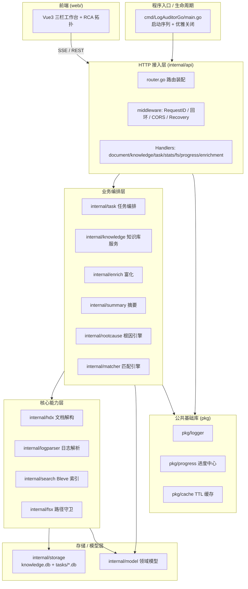

# LogAuditorGo 架构与模块说明书

> 本文档对 `LogAuditorGo`（华为网络设备日志智能分析平台）进行逐模块的详尽说明，涵盖启动流程、后端各 `internal`/`pkg` 包、前端 `web` 工程、核心数据流、配置、API 总表、安全设计与测试体系。
> 配套文档：`代码审计报告.md`、`审计问题修复方案.md`。

---

## 目录

1. [项目概览](#1-项目概览)
2. [整体分层架构](#2-整体分层架构)
3. [工程目录结构详解](#3-工程目录结构详解)
4. [启动流程（Bootstrap）](#4-启动流程bootstrap)
5. [后端模块说明书](#5-后端模块说明书)
   - 5.1 [`cmd/LogAuditorGo`](#51-cmdlogauditogo-程序入口)
   - 5.2 [`internal/config`](#52-internalconfig-配置中心)
   - 5.3 [`pkg`（公共基础库）](#53-pkg公共基础库)
   - 5.4 [`internal/fsx`](#54-internalfsx-路径安全守卫)
   - 5.5 [`internal/hdx`](#55-internalhdx-hdx-文档解构引擎)
   - 5.6 [`internal/knowledge`](#56-internalknowledge-知识库服务)
   - 5.7 [`internal/search`](#57-internalsearch-bleve-全文检索引擎)
   - 5.8 [`internal/logparser`](#58-internallogparser-华为日志解析引擎)
   - 5.9 [`internal/matcher`](#59-internalmatcher-四级知识匹配流水线)
   - 5.10 [`internal/summary`](#510-internalsummary-日志语义摘要引擎)
   - 5.11 [`internal/enrich`](#511-internalenrich-日志富化服务)
   - 5.12 [`internal/rootcause`](#512-internalrootcause-根因分析引擎)
   - 5.13 [`internal/model`](#513-internalmodel-领域数据模型)
   - 5.14 [`internal/storage`](#514-internalstorage-sqlite-存储管理)
   - 5.15 [`internal/task`](#515-internaltask-任务业务层)
   - 5.16 [`internal/api`](#516-internalapi-http-api-层)
6. [前端模块说明书（`web/`）](#6-前端模块说明书web)
7. [核心数据流](#7-核心数据流)
8. [配置说明](#8-配置说明)
9. [RESTful API 总表](#9-restful-api-总表)
10. [安全设计](#10-安全设计)
11. [测试与质量保障](#11-测试与质量保障)

---

## 1. 项目概览

`LogAuditorGo` 是一款**离线、纯 Go 原生、单二进制分发**的华为网络设备日志智能分析平台，面向 CloudEngine 交换机、HiSecEngine / USG 防火墙、NetEngine 路由器等。其核心价值是把"海量日志检索"升级为"带官方知识库语义关联 + 根因推导（RCA）"的故障定位能力。

**关键特征**

- **零 CGO 依赖**：使用 `modernc.org/sqlite`（`glebarez/sqlite`）纯 Go SQLite 驱动 + Bleve 纯 Go 倒排索引，可在任意平台交叉编译为单一可执行文件。
- **前端内嵌**：通过 Go `embed.FS` 将 `web/dist` 打包进二进制，部署零外部文件。
- **任务级物理隔离**：每个审计任务独占一个 SQLite 库文件（`tasks/task_xxx.db`），归档/导出/删除无残留。
- **四级知识匹配 + RCA**：从精确匹配到 Bleve 语义召回的逐级降级，叠加基于故障传播 DAG 的根因推导。

**技术栈**

| 层 | 选型 |
| :-- | :-- |
| 后端语言 | Go 1.26+ |
| Web 框架 | Gin (`gin-gonic/gin`) |
| ORM | GORM (`gorm.io/gorm`) |
| 嵌入式 DB | modernc.org/sqlite（无 CGO） |
| 全文检索 | Bleve v2 (`blevesearch/bleve/v2`) |
| HTML 解析 | goquery (`PuerkitoBio/goquery`) |
| 编码转换 | `golang.org/x/text`（GBK/GB2312） |
| 配置 | Viper (`spf13/viper`) |
| 日志 | Zap (`uber.org/zap`) |
| 前端 | Vue 3.5 + Vite 6 + Element Plus 2.9 + ECharts 5.6 + Pinia 2.3 + vue-router 4.5 |

---

## 2. 整体分层架构



---

## 3. 工程目录结构详解

```text
LogAuditorGo/
├── cmd/
│   └── LogAuditorGo/
│       ├── main.go            # 程序主入口：启动序列 + 信号优雅关闭
│       └── server_test.go     # 端到端集成与路由测试
├── internal/
│   ├── api/                   # HTTP API 路由与控制器（见 5.16）
│   ├── config/                # 系统配置解析（Viper，见 5.2）
│   ├── fsx/                   # 路径安全守卫（SecurePathGuard，见 5.4）
│   ├── hdx/                   # HDX 文档解构引擎（见 5.5）
│   ├── knowledge/             # 知识库服务与去重逻辑（见 5.6）
│   ├── search/                # Bleve 全文检索引擎（见 5.7）
│   ├── logparser/             # 华为日志解析引擎（见 5.8）
│   ├── matcher/               # 四级知识匹配流水线（见 5.9）
│   ├── summary/               # 日志语义摘要引擎（见 5.10）
│   ├── enrich/                # 日志富化服务（见 5.11）
│   ├── rootcause/             # 根因分析 RCA 引擎（见 5.12）
│   ├── model/                 # 全局领域数据模型（见 5.13）
│   ├── storage/               # SQLite 存储管理（见 5.14）
│   └── task/                  # 任务业务层（见 5.15）
│       └── templates/         # 外置 HTML 报告模板（go:embed）
├── pkg/
│   ├── cache/                 # 轻量带 TTL 的内存缓存（见 5.3.1）
│   ├── logger/                # Zap 日志工具库（见 5.3.2）
│   └── progress/              # 长任务进度追踪器（见 5.3.3）
├── web/                       # Vue 3 前端工程（见 6）
├── build.bat / build.sh       # 前端构建 + 单二进制打包脚本
├── go.mod / go.sum
└── docs/                      # 架构与审计文档
```

---

## 4. 启动流程（Bootstrap）

入口文件 `cmd/LogAuditorGo/main.go`（约 196 行，包 `main`）。启动序列严格有序，确保依赖先就绪：

1. **命令行参数解析**（优先级：命令行 > 配置 > 默认）
   - `-config <path>`：指定配置文件，默认 `<data_dir>/config.yaml`
   - `-port <n>`：覆盖监听端口（0–65535，否则报错退出）
   - `-version`：打印 `LogAuditorGo v1.0.0` 后退出
2. **配置加载**：`cfg, err := config.Load(*configPath)`，失败 `os.Exit(1)`。
3. **日志子系统初始化 + 热更新钩子**
   - `logger.InitWithConfig(...)` 按 `cfg.Log` 初始化 Zap。
   - `config.RegisterLogUpdateHook(...)` 注册日志留存策略/级别/格式运行时热更新钩子（ARCH-13，补充原未生效的 `format` 切换）。
4. **全局知识库 SQLite 初始化**：`storage.InitKnowledgeDB(cfg.Storage.KnowledgeDB)` → `*gorm.DB`，并写入包级单例 `storage.GlobalKnowledgeDB`。失败 `log.Fatalf`。
5. **Bleve 全文检索引擎初始化**：`search.InitIndexer(cfg.Storage.BleveIndex)`。失败 `log.Fatalf`。
6. **业务引擎装配**（依赖顺序刻意设计）
   ```go
   knowledgeSvc := knowledge.NewService(globalDB, indexer)
   knowledgeSvc.SetExtractDir(cfg.Storage.UploadDir)
   matchEngine  := matcher.NewMatchEngine(globalDB, indexer)
   knowledgeSvc.SetMatchEngine(matchEngine)   // 知识服务持有匹配引擎，导入后触发 Reload
   rcaEngine    := rootcause.NewEngine()
   taskSvc      := task.NewService(globalDB, cfg.Storage.TaskDir, matchEngine, rcaEngine)
   ```
7. **路由与 HTTP 服务器构建**：`r := api.SetupRouter(cfg, globalDB, knowledgeSvc, indexer, taskSvc)`，随后构造 `http.Server`。
8. **HTTP 超时常量**（ARCH-05，防御 Slowloris）
   - `ReadHeaderTimeout = 10s`、`ReadTimeout = 60s`、`IdleTimeout = 120s`
   - `WriteTimeout = 0`：**刻意不限制写入超时**，因为 SSE 进度流与长耗时导入（可达数分钟）需长时间持有连接。
   - `shutdownTimeout = 15s` 优雅关闭超时。
9. **信号与启动 goroutine 设计**（ARCH-04）
   - `signal.Notify(quit, os.Interrupt, syscall.SIGTERM)`（`SIGINT`/`SIGTERM`，去除重复注册）。
   - 监听在独立 goroutine 内执行；启动失败时仅向 `quit` 发信号再优雅关闭，**不直接 `log.Fatalf`**，避免绕过 `defer` 造成 Bleve/SQLite 资源泄漏。
10. **阻塞等待** `sig := <-quit`，随后以 15s 超时 `context` 执行优雅关闭（关闭 `http.Server`、释放索引与 DB 句柄）。

---

## 5. 后端模块说明书

### 5.1 `cmd/LogAuditorGo/` 程序入口

| 文件 | 职责 |
| :-- | :-- |
| `main.go` | 引导编排：参数 → 配置 → 日志 → DB → 索引 → 引擎 → 路由 → 服务器 → 信号/优雅关闭 |
| `server_test.go` | 端到端集成测试：启动 `httptest` 服务器、验证路由装配与统一响应契约 |

---

### 5.2 `internal/config/` 配置中心

基于 Viper 的 YAML 配置加载，支持默认值回退与环境覆盖。关键能力：

- `config.Load(path)`：读取 `config.yaml`，缺失时使用内置默认模板；首次启动在 `<data_dir>/config.yaml` 自动生成。
- 包级配置热更新钩子：`config.RegisterLogUpdateHook(func(maxSizeMB, maxDays int, level, format string))`，供运行时（通过 API `PUT /system/config/log`）动态切换日志级别/格式/留存策略。
- 配置结构覆盖 `server`（port/mode）、`storage`（data_dir/knowledge_db/bleve_index/task_dir/upload_dir/allowed_roots）、`log`（level/format/dir/max_size_mb/max_days）。

---

### 5.3 `pkg/`（公共基础库）

#### 5.3.1 `pkg/cache/` — 轻量 TTL 内存缓存
提供带过期时间的并发安全内存缓存，用于全局统计快照等热点数据（如仪表盘统计 15s 缓存）。避免对知识库/任务库的高频聚合查询。

#### 5.3.2 `pkg/logger/` — Zap 日志工具库
- `logger.InitWithConfig(Config{Level, Format, Dir, MaxSizeMB, MaxDays})`：初始化 Zap，支持 `console`（彩色）与 `json` 两种格式。
- `logger.UpdatePolicy(maxSizeMB, maxDays)` / `logger.SetLevel(level)` / `logger.SetFormat(format)`：运行时热更新（配合 `config.RegisterLogUpdateHook`）。
- 按大小/天数轮转，落盘至 `LogAuditorGoData/log`。

#### 5.3.3 `pkg/progress/` — 长任务进度追踪器
- 核心类型 `progress.JobTracker`：以 `job_id` 标识一次长任务（文档导入、重分析、索引重建、日志导入等）。
- 支持 `context` 级联取消：提供协作式终止能力（API `DELETE /progress/:job_id` 触发），阶段检查点轮询 `ctx.Err()` 决定是否中止。
- 进度快照可被 `internal/api/progress_handler.go` 通过 HTTP 轮询或 SSE 推送；`pkg/progress` 是两者的数据底座。

---

### 5.4 `internal/fsx/` 路径安全守卫

- 核心类型 `fsx.SecurePathGuard`，由 `fsx.NewSecurePathGuard(allowedRoots []string)` 构造。
- `ValidateAll(paths ...string) error`：当配置了 `storage.allowed_roots` 白名单时，任何跳出白名单根目录的路径都会被拒绝（返回错误，由 API 层转 403）；留空则不限制（本地单机默认行为）。
- `fsx.Root{Name, Path}`：作为文件系统浏览接口的可选根目录/快捷入口。
- 该守卫在 `api.router.go` 中作为**包级单例** `pathGuard` 创建，被所有导入类接口共用（ARCH-02）。

---

### 5.5 `internal/hdx/` HDX 文档解构引擎

华为官方 HDX 文档（`.hdx`/`.zip` 压缩包或含 `profile.xml` 的解压目录）的解构流水线：

| 文件 | 职责 |
| :-- | :-- |
| `extractor.go` | 文档目录扫描与 `profile.xml` 解析；区分 `.hdx`/`.zip`（**流式读取、零磁盘解压**）与解压目录；产出文档元数据与叶子节点清单 |
| `navigator.go` | `navi.xml` 导航树递归解析；按叶子节点过滤出 Log Reference / Alarm Reference |
| `html_parser.go` | 基于 `goquery` 的 HTML 字段抽取：日志标识、模板、含义、动态参数、可能原因、处理步骤、Trap OID、MIB 模块等 |
| `charset.go` | GBK/GB2312 → UTF-8 自动转码（依赖 `golang.org/x/text`） |

**解析产物**：归一化的知识条目（`model.Knowledge` 候选集），交由 `internal/knowledge` 做去重与入库。`hdx.ScanHDXPaths` 亦被文档扫描接口复用。

---

### 5.6 `internal/knowledge/` 知识库服务

知识库 CRUD、SHA256 去重、版本映射与索引管理的中枢。

- **去重与指纹**：`CalculateContentHash(k)` 计算 SHA-256 内容指纹；导入时按 `seenHashes` 去重，并按内容哈希持久化 `content_hash` 唯一索引。
- **导入编排 `importSingleDocUnlocked(src, conflictMode, tr)`**（按 `src.ID()` 加锁）：
  1. `readDocumentMetadata` — 读取文档元数据（命中 `skipped` 则直接返回）；
  2. `parseHTMLKnowledgeItems` — 解析 HTML 知识条目（失败按哈希去重收集）；
  3. `persistKnowledgeAndMappings(tx, ...)` — 单事务内：文档 upsert（命中旧版先删旧版本映射）、**分批查重（每 500 个 `content_hash` 一批）**、`CreateInBatches(newKnowledges, 100)`、版本映射 `CreateInBatches(100)`（KB-15 修复：查重失败上抛，避免撞唯一索引导致整批回滚）；
  4. `indexDocumentKnowledge` — **索引本文档关联的全部知识（含历史，KB-04 修复）**，刷新版本列表。
- **导入自愈（KB-01）**：索引失败不再仅打 Warn，而是 `markDocumentIndexDirty`（落 `index_dirty=true`，前端提示重建）；成功则 `clearDocumentIndexDirty`。
- **删除与孤儿清理 `DeleteDocuments(docIDs)`**：
  1. Pluck 本批文档关联的 `knowledge_id`（Distinct）；
  2. 事务内删 `KnowledgeVersionMapping`（按 `document_id IN ?`）→ 删 `Document`；
  3. **孤儿清理（KB-07）**：重查仍被引用的 `knowledge_id` 计算差集得孤儿 → **先删 Bleve 索引 `DeleteBatch`，后删 DB**（避免"索引已删/DB 仍在"的反向不一致）；索引删失败返回含"请全量重建索引"的提示，不阻断 DB 清理。
  4. `matchEngine.Reload()` 触发匹配引擎重载。
- **查询**：`GetDocumentList()`、`GetKnowledgeByID`、`GetKnowledgeByIDs`（批量避免 N+1）、`GetKnowledgeMapByIDs`（ID→实体映射）。
- **匹配桥接**：`FindBestKnowledgeMatch(candidates, targetProduct, targetVersion)` → `matcher.FindBestKnowledgeMatch`（多版本回退：同型号最新 → 同系列相近 → 全局通用协议）。
- **索引重建**：`reindex.go` 在临时目录全量重建 Bleve 索引后**原子热替换**，重建期间不影响现有检索。

---

### 5.7 `internal/search/` Bleve 全文检索引擎

| 文件 | 职责 |
| :-- | :-- |
| `bleve_indexer.go` | 倒排索引构建、文档分词、多字段布尔组合检索（支持 `keyword`/`module`/`entry_type`/`severity` 等） |
| `rebuild.go` | 索引重建底座：临时目录构建 + 原子替换 |

- `search.InitIndexer(path)` 在启动时初始化/打开或新建 Bleve 索引。
- 支持中文关键词分词匹配与错误代码秒级召回。
- `IndexKnowledge(items)` 幂等，覆盖写即可刷新版本列表（供 KB-04 全量重索引使用）。
- `GetIndexStatus` 提供索引健康状态（索引文档数与数据库记录数一致性），供系统设置页展示。

---

### 5.8 `internal/logparser/` 华为日志解析引擎

| 文件 | 行数 | 职责 |
| :-- | :-- | :-- |
| `parser.go` | 87 | 统一接口 `LogParser` + 无锁注册表 + 自动分发 |
| `vrp_parser.go` | 164 | 华为 VRP Syslog 正则解析器（主 + 兜底） |
| `sec_parser.go` | 128 | USG 防火墙安全日志解析器 |
| `comment_parser.go` | 122 | `#` 开头的设备注释/元数据（文件头/摘要/防篡改校验）解析 |
| `param_extractor.go` | 293 | 消息正文 `Key=Value` 动态参数提取（手写扫描器） |
| `time_parser.go` | 354 | 多格式时间戳标准化 |

**统一接口**（`parser.go`）
```go
type LogParser interface {
    Name() string
    Support(line string) bool
    Parse(line string) (*model.NormalizedLog, error)
}
```

**注册与分发机制**
- 注册表 `parserList atomic.Value` 持有 `[]LogParser`，无锁并发读；写时经 `regMu sync.Mutex` 复制出新切片存入，保证 `ParseLine` 不会读到半更新状态。
- `init()` 固定顺序注册：`CommentParser` → `USGSecurityParser` → `VRPParser`；`defaultVRP = &VRPParser{}` 为全局兜底。
- `ParseLine(line)`：遍历解析器，对 `Support(line)` 为真者调用 `Parse`，**成功即硬短路**；全部失败则 `defaultVRP.Parse` 兜底。panic 经 `recover` 转 error。
- `ParseBatch(lines)`：逐行 `ParseLine`，跳过空行，收集日志与带行号的错误。
- `RegisterParser(p)` 为可导出扩展点，支持运行时追加自定义解析器。

**VRP 解析器**
- 主正则 `vrpRegex` 命名捕获组：`pri / time / host / version / module / severity / brief / type / seq / slot / msg`。
- PARSE-10 修正：severity 由 `[1-8]` 放宽到 `[0-8]`（部分产品 Emergency 为 0）；类型组 `(?i:\((?P<type>[a-z])\))` 由必选改为可选（变体日志省略 `(l)/(s)`）。
- `vrpSimpleRegex` 处理丢弃 header 的变体；`vrpSupportRegex` 用 `%%\d{0,2}[A-Za-z0-9_\-]+/[0-8]/...` 预匹配 header。
- 输出 `NormalizedLog{DeviceType:"Huawei-VRP", ...}`，末步 `ExtractParameters(MessageBody)`。

**USG 解析器**
- `usgSecRegex` / `usgSecSupportRegex` 限定安全类模块（`SEC|UTM|IPS|AV|FW|SSLVPN|ATTACK|POLICY`）。
- 输出 `DeviceType:"Huawei-USG-Firewall"`，默认 `LogType:"s"`；正则失配时降级。

**参数与时间**
- `param_extractor.go`：手写扫描器抽取 `Key=Value`，兼容空值、空格、中文键名、同名键。
- `time_parser.go`：多格式时间戳与时区归一化（含回归测试覆盖边界）。

---

### 5.9 `internal/matcher/` 四级知识匹配流水线

| 文件 | 职责 |
| :-- | :-- |
| `engine.go` | 匹配调度器：Tier1~Tier4 逐级降级 |
| `scoring.go` | 置信度评分模型 |

**四级流水线**（逐级降级，命中即返回，置信度自上而下）

| 层级 | 名称 | 置信度 | 策略 |
| :-- | :-- | :-- | :-- |
| Tier 1 | EXACT | 1.0 | 模块与助记符（Brief）完全一致 |
| Tier 2 | MNEMONIC | 0.90 | 助记符别名与常见状态后缀（`_active`/`_fail`/`_down` 等）模糊匹配 |
| Tier 3 | TEMPLATE | 0.80 | 参数占位符转义与日志正文模板反向正则匹配 |
| Tier 4 | BLEVE | 0.50~0.75 | 基于 Bleve 倒排索引的语义打分召回 |
| Tier 5 | UNMATCHED | — | 标记未匹配 |

- **Tier1 软短路降级**：`export_test.go` 覆盖的回归点——当高置信匹配与低版本分档冲突时，采用软短路 + 版本分档打分，优先最新/最相关版本。
- `FindBestKnowledgeMatch(candidates, targetProduct, targetVersion)` 供 `knowledge` 服务做多版本回退选优。

---

### 5.10 `internal/summary/` 日志语义摘要引擎

**唯一真入口**：包级函数 `summary.GenerateSummary(module, brief, severity, rawMsg, params, kb)`，外部不直接构造 `Engine`（`Engine`/`DefaultEngine` 仅供该函数内部使用）。

**三级优先级生成策略**
1. **COMMENT 短路**：`module == "COMMENT"` → `BuildCommentSummary`（文件头/摘要/防篡改校验注释）。
2. **知识库语义**（kb != nil）：`BuildKnowledgeSummary` → `CleanDescriptionTitle`（剥 HTML/取首句/限 60 字）→ `ExtractCoreContextParams`（按别名组解析高价值字段：接口/IP/对端/原因，限 30 字、取前 3、稳定性排序）→ 拼 `"%s [%s]"`；否则用 `kb.Message` 经 5 方言占位符（`精确→规范化→别名反查`）模板渲染（限 120 字）。
3. **通用自适应兜底** `BuildAdaptiveGenericSummary`：从 `module/brief/参数/原始报文` 抽取（限 100 字）。

**确定性保证（RCA-11/15）**：输出反向索引 + 全处 `sort.Strings`/`SliceStable`，对相同输入完全确定；任意输入均返回非空（最坏 `"—"`）。

**别名分档 `alias_groups.go`**：15 组同义词池，把协议差异吸收为"语义角色"（如 BGP/OSPF/EVPN 的"对端"统一为 `peer`），引擎核心零协议硬编码。

**集成方式**
- 被 `internal/enrich.Service.EnrichLogs` 作为核心部件复用（单设备日志富化）。
- 被 `internal/task.Service` 在多设备时间线 `QueryMultiDeviceLogs` 中内联调用（`summary.GenerateSummary` 直接算 `EventSummary`）。
- 产物 `EventSummary` 经 `model` 流出到 Web Workbench / 多设备时间线 / JSON 导出；**未进入 HTML 报告模板与 CSV 导出**（当前集成缺口）。

---

### 5.11 `internal/enrich/` 日志富化服务

将匹配结果与日志记录装配为前端可用的富化结构（ARCH-12：原逻辑下沉自 `api/task_handler.go`，使 CLI 与报告导出可复用）。

- `Service.EnrichLogs(records)`：批量收 `KnowledgeID`（一次 `IN` 查询 `GetKnowledgeMapByIDs`，不在循环内逐条查库）→ `ParseParametersJSON(rec.ParametersJSON)` → 计算 `er.EventSummary`（`summaryFor`）、`EnrichedParameters`、`ContextualizedKB`、`RenderedMessage`。
- 复用 `summary.PlaceholderRegex` / `summary.NormalizeKey`，并包一层 `enrich.GenerateEventSummary(...)`.
- `internal/api/enrichment.go` 仅做类型别名与转发（`EnrichedParameter = enrich.EnrichedParameter` 等），保证既有 API 契约与前端字段不变。

---

### 5.12 `internal/rootcause/` 根因分析引擎

| 文件 | 行数 | 职责 |
| :-- | :-- | :-- |
| `engine.go` | 867 | 索引构建、规则匹配、BFS 传播、置信度评分、影响等级、RCA 事件产出 |
| `topology_dag.go` | 153 | 故障传播 DAG 规则库（`DefaultRules`）、`Pattern`/`DAGEdge`/`ProtocolFaultRule`、检环 |
| `cluster.go` | 126 | 重叠滑动窗口时间聚类（`ClusterByOverlappingWindow`） |

**RCA 数据模型**（`model/rca.go`）

```go
type ImpactEvent struct {           // 单条衍生影响事件（链上节点）
    LogID, FromLogID uint
    FromModule, Module, Brief, Timestamp string
    DelayMs int64                     // 相对根因的延迟
}
type RCAEvent struct {              // 根因事件（GORM 持久化主表）
    ID uint
    RootLogID uint `gorm:"index"`
    RootModule, RootBrief, RootTimestamp, RootCauseSummary string
    CorrelatedLogIDs string          // JSON: [105,108,112]
    ImpactEventsJSON  string          // JSON: []ImpactEvent（完整传播链）
    ImpactLevel string               // CRITICAL / HIGH / MEDIUM / LOW
    Confidence float64
    RecommendedAction string
}
type EnrichedRCAEvent struct { RCAEvent; RootLog *LogRecord; ImpactDetails []ImpactLogDetail; ... }
```

**算法流程**
1. **重叠滑动窗口聚类**（`cluster.go`）：300s 窗口 + 60s 边缘重叠，避免硬边界切断跨窗口长因果链。
2. **倒排索引 BFS 推导**（`engine.go`）：基于故障传播 DAG，以 O(k·m) BFS 从候选事件推导根因。
3. **实例维度校验**：对传播链上的每条日志做实例（如接口、对端 IP）一致性校验。
4. **全局排他认领**：每条日志唯一归属一个根因（避免重复认领）。
5. **多因子置信度评分**：综合层级、传播深度、实例匹配度等。

**故障传播 DAG（`topology_dag.go` `DefaultRules`）** 内置典型链：
- 物理链路中断 → BFD Down → 路由邻居中断 → 路由撤销
- 光模块异常 → CRC 错包 → 端口 Down
- RADIUS 故障 → 认证失败 → 批量下线
- M-LAG Peerlink → DAD → 端口隔离

规则以 `ProtocolFaultRule`/`DAGEdge`/`Pattern` 数据结构编码，并内置**环检测**（避免环路导致 BFS 死循环）。

---

### 5.13 `internal/model/` 领域数据模型

全局领域模型，同一份 struct 定义被全局库与任务库共享（不同 DB 实例）。关键实体：

- **`TaskInfo`**：任务元信息（`TaskID` 主键、`DeviceType`、`DeviceVersion`(PARSE-04 透传版本量化分档)、`FileCount`、`DeviceCount`、`LogCount`、`MatchedCount`、`RcaCount`、`DBPath`、`Status`(PENDING/PROCESSING/COMPLETED/FAILED)、`StartTime`、`FinishTime`）。**双写**全局库（任务列表）与任务库（自包含）。
- **`TaskFile`**：已上传文件记录。
- **`LogQueryFilter`**：分页（含 `AfterID` 游标分页，TASK-13 避免深翻页 offset 开销）+ 多维过滤（severity/module/hostname/sourceFile/matched/timeRange）。
- **`NormalizedLog`**：解析期标准结构（`RawLog/Timestamp/Hostname/DeviceType/Module/Severity/Brief/LogType/Sequence/SlotInfo/SourceFile/MessageBody/Parameters`，以及匹配结果 `KnowledgeID/MatchTier/MatchConfidence/DeviceID/EventSummary`）。
- **`LogRecord`**：落到任务库的实体；`Parameters` 以 `ParametersJSON` 字符串持久化，`EventSummary` 标记 `gorm:"-"` 不持久化（查询期实时算）。`DeviceID=0` 表示"未归属"。
- **`Knowledge`**：知识库条目（全局库），含 `EntryType`(LOG/ALARM)、`Module`、`Severity`、`Brief`、`TrapOID`、`MIBName`、`AlarmID`、`Message`、`Description`、`Parameters`、`Impact`、`Cause`、`ContentHash`、版本映射 `Versions`。
- **`Document`**：HDX 文档元数据（`LibID`/`LibName`/`ProductType`/`ProductVersion`/`LogCount`/`AlarmCount`/`IndexDirty`）。
- **`KnowledgeVersionMapping`**：知识条目 ↔ 文档的版本适用映射。
- **`RCAEvent` / `ImpactEvent` / `EnrichedRCAEvent` / `ImpactLogDetail`**（见 5.12）。
- **`DeviceTimelineEvent`**：多设备时间线事件，含 `EventSummary`。
- 所有模型均显式声明 `TableName()`。

---

### 5.14 `internal/storage/` SQLite 存储管理

| 文件 | 职责 |
| :-- | :-- |
| `knowledge_db.go` | 全局知识库连接与自动迁移；`InitKnowledgeDB(path)` 返回 `*gorm.DB` 并写入包级单例 `storage.GlobalKnowledgeDB` |
| `task_db.go` | 任务库**引用计数连接池**：按 `task_<id>.db` 缓存 `*gorm.DB`，引用计数归零方可关闭/驱逐；删除任务时**先关句柄后删文件**，保证 Windows 下无句柄残留 |

- **任务级物理隔离**：每个审计任务独立 SQLite 文件，归档/导出/删除互不影响。
- **连接池设计**：高频任务复用同一连接；引用计数 + 后台驱逐避免句柄泄漏；Windows 删除顺序规避"文件被占用无法删除"问题。

---

### 5.15 `internal/task/` 任务业务层

任务编排、设备与多设备协同、导入流水线、重分析、报告聚合与流式导出的核心业务层。

| 文件 | 职责 |
| :-- | :-- |
| `service.go` | 任务编排、设备 CRUD、多设备协同业务（时间线/联合查询/报告） |
| `import_pipeline.go` | 导入流水线：并发解析 + 分批事务落库 |
| `import_prepare.go` | 导入前置：流式扫描、解码（GBK）、设备嗅探 |
| `reanalyze_update.go` | 重分析批量回写（`CASE WHEN` 批量 `UPDATE`，避免逐条） |
| `report_aggregate.go` | 报告指标 SQL 预聚合（采样范围由聚合得出，非前 N 条截断） |
| `conclusion.go` | 结论文案数据驱动生成 |
| `exporter.go` | HTML / JSON / CSV **流式导出**（内存占用恒定） |
| `templates/` | 外置 HTML 报告模板（`report.html.tmpl` / `multi_device.html.tmpl`，`go:embed`） |

**导入流程**：`import_prepare`（流式扫描+解码+设备嗅探）→ `import_pipeline`（并发解析 + 分批事务落库，冲突策略 `overwrite/skip/rename`）→ 落 `LogRecord` → 触发匹配回写。

**多设备协同**：`service.go` 支持设备建模、`auto-assign`（按 Hostname 自动归属未绑定记录，不覆盖人工设置）、联合时间线（按绝对时间升序归并）、跨设备影响面报告。

**流式导出**（`exporter.go`）：CSV 按行游标流式写出、JSON 流式数组拼装、HTML 指标 SQL 聚合 + 明细采样，内存占用恒定，不受导出条数上限掣肘。

---

### 5.16 `internal/api/` HTTP API 层

| 文件 | 职责 |
| :-- | :-- |
| `router.go` | Gin 路由与中间件装配（`SetupRouter`） |
| `response.go` | 统一响应信封（`SuccessResponse`/`ErrorResponse`） |
| `middleware.go` | `RequestIDMiddleware`、回环校验、路径白名单守卫、CORS |
| `document_handler.go` | 文档扫描/导入/列表/删除 |
| `knowledge_handler.go` | 知识检索/详情/索引状态/重建 |
| `task_handler.go` | 任务生命周期、设备、多设备查询、富化转发 |
| `stats_handler.go` | 仪表盘统计（带缓存与主动失效） |
| `fs_handler.go` | 服务端本地文件系统只读浏览 |
| `progress_handler.go` | 长任务进度查询/SSE/终止 |
| `enrichment.go` | 富化类型别名与转发 |

**Gin 运行模式（ARCH-15）**：依据 `cfg.Server.Mode` 显式 `switch`（`debug`/`test`/`release`），未知值回退 `ReleaseMode` 并告警，避免误停留在 debug。

**中间件链（注册顺序）**
1. `RequestIDMiddleware()` — 最前，使所有中间件/handler 的 5xx 均带同一可追溯 ID（`X-Request-ID`）。
2. `r.SetTrustedProxies(nil)` — 禁用 `X-Forwarded-For`/`X-Real-IP` 信任（ARCH-01，本地单机最安全）。
3. `gin.CustomRecovery(...)` — panic 栈写入 Zap 并返回 500（ARCH-09）。
4. 内联 CORS 中间件 — 仅白名单来源设置 `Access-Control-Allow-Origin` + `Vary: Origin`；未通过来源不设 ACAO（ARCH-08，原兜底 `*`）。`OPTIONS` 返回 204。

**统一响应信封**（`response.go`）：`{"code":0,"message":"success","data":...}`（成功） / `{"code":<code>,"message":<msg>,"data":nil}`（失败）。**错误脱敏（ARCH-06）**：`httpStatus >= 500` 时完整错误仅写 Zap，对外统一返回 `"Internal Server Error (request_id: <id>)"`；4xx 回具体原因。

**SPA/静态资源兜底**：通过 `web.DistFS()`（embed）托管前端；API 未命中返回 404 JSON（带 `data:nil` 契约一致）；具体静态文件直接 `fileServer.ServeHTTP`；前端路由返回 `index.html`；未打包前端则降级 JSON 状态提示。

**包级单例协作**：`pathGuard`（全局路径守卫）、`globalStatsHandler`（供业务层主动失效统计缓存）、`fsHandler`。

---

## 6. 前端模块说明书（`web/`）

**技术栈**：Vue 3.5（`<script setup>`）+ Vite 6.1 + Element Plus 2.9（中文 locale `zh-cn`）+ ECharts 5.6（按需注册）+ Pinia 2.3 + vue-router 4.5 + Axios 1.7。

**构建要点**（`vite.config.js`）
- `base: './'` 相对路径，支持任意子目录部署。
- `chunkSizeWarningLimit: 1000`；`manualChunks` 分包：`echarts` / `vue`(vue+router+pinia) / `element` / `vendor`(axios)。
- `server.proxy`：`/api` → `http://localhost:8080`。

**路由地图**（`router/index.js`，`createWebHistory`）

| 路径 | 名称 | 组件 | 说明 |
| :-- | :-- | :-- | :-- |
| `/` | Dashboard | `Dashboard.vue` | 概览 4 卡 + Top10 模块分布 + 快捷建任务 |
| `/audit` `/audit/:id` | AuditWorkbench / AuditTaskDetail | `AuditWorkbench.vue` | 三栏工作台（`watch` params 复用实例刷新） |
| `/knowledge` | KnowledgeCenter | `KnowledgeCenter.vue` | 知识检索 + 详情抽屉 |
| `/documents` | Documents | `Documents.vue` | HDX 文档管理 |
| `/tasks` | Tasks | `Tasks.vue` | 历史任务列表 |
| `/settings` | Settings | `Settings.vue` | 日志策略 + 日志文件清单 |
| `/:pathMatch(.*)*` | NotFound | `NotFound.vue` | 404 兜底（最后） |

**三栏工作台**（`AuditWorkbench.vue`）
- 顶部：`currentTaskId` 选择器、设备类型/匹配率徽标、5 个视图模式（`workbench`/`devices`/`multi-timeline`/`rca`/`multi-report`，由 `constants/viewModes.js` 驱动；脏值回退默认）。
- 左栏（28%）：动态筛选（关键词/级别/匹配状态/设备/来源文件）+ 日志流卡片（按 severity 着色）。
- 中栏（36%）：选中日志结构化解析——原始报文、事件语义摘要、核心字段、动态变量与文档融合、官方模板实例化（现场值注入高亮）、RCA 联动提示。
- 右栏（36%）：双页签——"官方知识与处理步骤"（现场参数注入开关）+"根因传播拓扑 (RCA)"（`RcaGraph`）。
- 未激活视图用 `v-if` 不挂载（WEB-02 避免无效请求）。

**状态管理（Pinia）**
- `useTaskStore`（id `task`）：`taskList/currentTask/currentTaskId/taskFiles/taskDevices/logRecords/rcaEvents/rcaIndexByLogId`（Map 倒排索引 O(1) 命中，WEB-13）。三视图共享，避免重复拉取。
- `useFilterStore`（id `filter`）：`filters`（含 `viewMode`/`rcaLevel` 等），深度监听 `watch` 持久化到 `localStorage`（刷新恢复，WEB-05）。
- `useProgressStore`（id `progress`）：`activeJobs` Map、`visibleJobId`、`dialogVisible`；`closeDialog` 仅隐藏不终止（UI-01），`cancelJob` 协作式取消，`prune(finishedTTL=5min)` 清理过期终态（避免 Map 无界增长）。

**与后端通信**（`api/index.js`）
- `axios.create({ baseURL:'/api/v1', timeout:30000 })`；长耗时 `LONG_TIMEOUT=300000`，导出 `EXPORT_TIMEOUT=600000`。
- 响应拦截：`code !== 0` 报错 reject；静默忽略 `CanceledError`/`ERR_CANCELED`（WEB-08）。
- 进度：`getProgress`(GET) / `cancelProgress`(DELETE) / `createProgressStream`(EventSource SSE)。
- 完整端点覆盖：进度、文件系统（只读本机）、系统（stats/config/logs/index）、文档、知识库、任务、设备管理、多设备（logs/timeline/report/export）。详见 [API 总表](#9-restful-api-总表)。

**关键组件**（`components/`，7 个）
- `ImportProgressModal.vue`（核心，27KB）：全流程阶段进度弹窗，接入 SSE→轮询降级、后台运行/终止/重试/复制；三处复用。
- `RcaGraph.vue`：ECharts `GraphChart` 渲染 RCA 故障传播 DAG（红色根因 + 橙色衍生 + `+delay_ms` 边）。
- `RcaCenter.vue`（20KB）：独立 RCA 联动中心（左 KPI+事件列表，右拓扑/时序链/处置指南）。
- `ServerPathPicker.vue`（23KB）：服务端只读路径选择器，`el-tree` 懒加载 + 窗口化虚拟滚动（UI-08，应对海量文件）。
- `DeviceManager.vue`（22KB）：设备管理表格 + 新建/编辑/删除 + 按 Hostname 自动识别 + 单设备导入。
- `MultiDeviceTimeline.vue`（34KB）：多设备协同时间线，设备勾选 + 跨设备时序对比（预计算 `_summary` 缓存，UI-06）。
- `MultiDeviceReport.vue`（12KB）：多设备对比诊断报告导出 HTML。

**可复用逻辑与插件**
- `composables/useRequest`：AbortController + 请求序号竞态守卫（WEB-08）。
- `composables/useReanalyze`：收敛 Tasks 与 AuditWorkbench 的"重新分析"流程（WEB-16）。
- `plugins/icons.js`：按需注册约 36 个图标（解决全量膨胀）。
- `plugins/echarts.js`：按需 `use([BarChart, GraphChart, ...])`。
- `constants/deviceTypes.js`（`TASK_DEVICE_TYPE` 5 种 / `DEVICE_FORM_TYPE` 7 种）、`constants/viewModes.js`。
- `utils/format.js`：`formatTime`（含 Go 零值保护）/ `formatSize`。

---

## 7. 核心数据流

### 7.1 HDX 文档入库流
```
.hdx/.zip（流式读）或 解压目录
  → hdx.extractor（profile.xml / 目录扫描）
  → hdx.navigator（navi.xml 叶子过滤）
  → hdx.html_parser（goquery 字段抽取）+ charset（GBK 转 UTF-8）
  → knowledge.importSingleDocUnlocked
       ├─ CalculateContentHash（SHA256 去重）
       ├─ persistKnowledgeAndMappings（事务 + 分批查重/写入）
       └─ indexDocumentKnowledge（全量重索引 + 自愈标记）
  → Bleve 索引 + knowledge.db
```

### 7.2 日志审计流
```
原始日志（文件/文本/服务端路径）
  → task.import_prepare（流式扫描 + GBK 解码 + 设备嗅探）
  → task.import_pipeline（并发解析 + 分批事务落库）
  → logparser.ParseBatch（VRP/USG/Comment 解析 → NormalizedLog + Parameters）
  → matcher（Tier1~4 逐级降级，写入 KnowledgeID/MatchTier/Confidence）
  → storage（task_xxx.db 的 LogRecord）
  → enrich.EnrichLogs（summary 摘要 + 知识装配）→ API 返回富化记录
```

### 7.3 RCA 根因推导流
```
任务日志（按时间有序）
  → rootcause.cluster（300s 重叠窗口聚类）
  → rootcause.engine（倒排索引 BFS + 实例校验 + 排他认领）
  → topology_dag（故障传播规则匹配）
  → RCAEvent（ImpactEventsJSON + ImpactLevel + Confidence + RecommendedAction）
  → 持久化 + API /getRCA + 前端 RcaGraph/RcaCenter 可视化
```

### 7.4 多设备协同流
```
设备管理（名称/Hostname/型号/角色）
  → auto-assign（按 Hostname 绑定未归属记录，不覆盖人工）
  → 联合时间线（绝对时间升序归并）
  → 协同影响面报告（MultiDeviceReport）
  → 导出 HTML/CSV（流式）
```

### 7.5 导出流
```
reports/exporter.go
  ├─ CSV：游标逐行流式写出
  ├─ JSON：流式数组拼装
  └─ HTML：report_aggregate 指标 SQL 预聚合 + 明细采样 + templates 渲染
```

---

## 8. 配置说明

默认配置文件 `LogAuditorGoData/config.yaml`（首次启动自动生成）：

```yaml
server:
  port: 8080
  mode: debug            # debug / release
storage:
  data_dir: "LogAuditorGoData"
  knowledge_db: "LogAuditorGoData/knowledge.db"
  bleve_index: "LogAuditorGoData/bleve/knowledge.bleve"
  task_dir: "LogAuditorGoData/tasks"
  upload_dir: "LogAuditorGoData/uploads"
  allowed_roots:         # 导入类接口根目录白名单（留空=不限制）
    - "D:/logs"
    - "D:/hdx"
log:
  level: info            # debug/info/warn/error
  format: console        # console/json
  dir: "LogAuditorGoData/log"
  max_size_mb: 1024
  max_days: 180
```

> 安全提示：`storage.allowed_roots` 留空时与旧版一致（不限制）；多用户/受限环境请显式配置，启动时校验并忽略无效项。

---

## 9. RESTful API 总表

### 系统与文档管理
| 方法 | 路径 | 描述 |
| :-- | :-- | :-- |
| GET | `/api/v1/system/stats` | 全局统计（文档/知识/任务/日志总量，15s 缓存） |
| GET | `/api/v1/system/config` | 当前配置 + 日志状态 |
| PUT/POST | `/api/v1/system/config/log` | 动态更新日志留存/级别/格式 |
| GET | `/api/v1/system/logs` | 日志文件统计与清单 |
| POST | `/api/v1/system/logs/clean` | 手动清理日志 |
| GET | `/api/v1/system/knowledge-index/status` | Bleve 索引健康状态 |
| POST | `/api/v1/documents/scan` | 递归扫描 `.hdx`/`profile.xml` 并解析元数据 |
| POST | `/api/v1/documents/import-dir` | 指定目录/压缩包导入（流式，返回 `job_id`） |
| GET | `/api/v1/documents` | 已导入文档列表 |
| DELETE | `/api/v1/documents/:id` | 删除文档及版本映射（含孤儿清理） |
| POST | `/api/v1/documents/batch-delete` | 批量删除 |

### 知识库检索
| 方法 | 路径 | 描述 |
| :-- | :-- | :-- |
| GET | `/api/v1/knowledge/search` | 多字段组合检索 |
| GET | `/api/v1/knowledge/:id` | 单条知识详情（含版本映射） |
| POST | `/api/v1/knowledge/reindex?async=true` | 触发索引物理重建（返回 `job_id`） |

### 任务审计与 RCA
| 方法 | 路径 | 描述 |
| :-- | :-- | :-- |
| POST | `/api/v1/tasks` | 创建任务（空任务/文本/路径导入） |
| GET | `/api/v1/tasks` | 任务列表 |
| GET | `/api/v1/tasks/:id` | 任务元信息 |
| GET | `/api/v1/tasks/:id/files` | 已导入文件列表 |
| POST | `/api/v1/tasks/:id/import` | 追加导入（conflict_mode=overwrite/skip/rename） |
| GET | `/api/v1/tasks/:id/logs` | 分页多维过滤查询日志与匹配结果 |
| GET | `/api/v1/tasks/:id/modules` | 任务内模块清单 |
| POST | `/api/v1/tasks/:id/reanalyze` | 重分析（批量回写，返回 `job_id`） |
| GET | `/api/v1/tasks/:id/rca` | RCA 根因事件与影响链路 |
| GET | `/api/v1/tasks/:id/export` | 导出报告（html/json/csv，流式） |
| DELETE | `/api/v1/tasks/:id` | 删除任务及物理 SQLite 文件 |

### 设备与多设备协同
| 方法 | 路径 | 描述 |
| :-- | :-- | :-- |
| POST/GET/GET/PUT/DELETE | `/api/v1/tasks/:id/devices[/:device_id]` | 设备 CRUD |
| POST | `/api/v1/tasks/:id/devices/:device_id/import` | 向设备导入日志 |
| POST | `/api/v1/tasks/:id/devices/auto-assign` | 按 Hostname 自动归属 |
| POST | `/api/v1/tasks/:id/multi-device/logs` | 多设备联合日志查询 |
| POST | `/api/v1/tasks/:id/multi-device/timeline` | 多设备联合时间线 |
| POST | `/api/v1/tasks/:id/multi-device/report` | 多设备协同影响面报告 |
| GET | `/api/v1/tasks/:id/multi-device/export` | 导出多设备报表（html/csv） |

### 进度与文件系统
| 方法 | 路径 | 描述 |
| :-- | :-- | :-- |
| GET | `/api/v1/progress/:job_id` | 进度快照（轮询） |
| GET | `/api/v1/progress/:job_id/stream` | 进度 SSE 实时推送 |
| DELETE | `/api/v1/progress/:job_id` | 终止长任务（协作式） |
| GET | `/api/v1/fs/roots` | 可浏览根目录（**仅本机回环**） |
| GET | `/api/v1/fs/browse` | 目录浏览（回环 + 白名单） |
| POST | `/api/v1/fs/stat` | 批量路径元信息 |

> `/api/v1/fs/*` 全部经 `RequireLoopback()` 限定本机回环；导入类接口另经 `storage.allowed_roots` 白名单守卫。

---

## 10. 安全设计

- **路径白名单守卫**（`fsx.SecurePathGuard` + `storage.allowed_roots`）：导入类接口所有路径经 `ValidateAll` 校验，跳出白名单返回 403。
- **回环限定**：`/api/v1/fs/*` 经 `RequireLoopback()`，仅本机可访问服务端文件系统浏览。
- **5xx 错误脱敏（ARCH-06）**：完整错误仅落 Zap，对外统一 `Internal Server Error (request_id: <id>)`，`X-Request-ID` 全程可追溯。
- **CORS 白名单（ARCH-08）**：仅白名单来源设置 ACAO + `Vary: Origin`，未通过来源不设头。
- **禁用代理头信任（ARCH-01）**：`SetTrustedProxies(nil)`。
- **自定义 Recovery（ARCH-09）**：panic 栈写入轮转日志文件而非仅 stderr。
- **HTTP 超时防御（ARCH-05）**：`ReadHeader/Read/Idle` 超时防御 Slowloris，`WriteTimeout=0` 支撑 SSE/长导入。
- **Gin 模式强制（ARCH-15）**：未知 mode 回退 release，杜绝误留 debug。

---

## 11. 测试与质量保障

**后端测试**（Go）
```bash
go test ./... -count=1                              # 全量套件
go test -v ./internal/rootcause/...                 # RCA 回归
go test -v ./internal/matcher/...                   # 匹配回归
CGO_ENABLED=1 go test ./... -race -count=1          # 竞态检测（需 gcc）
go vet ./...                                        # 静态检查
```

**关键回归锚点**

| 测试文件 | 覆盖内容 |
| :-- | :-- |
| `logparser/time_parser_regression_test.go` | 多格式时间戳与时区边界 |
| `logparser/variant_test.go` / `export_variant_test.go` | 华为变体（severity 0、缺省 type、多行粘包） |
| `logparser/param_extractor_test.go` | KV 空值/空格/中文键名/同名键 |
| `matcher/export_test.go` | Tier1 软短路降级与版本分档打分 |
| `rootcause/rca_regression_test.go` | 重叠窗口聚类、跨窗口链路完整性、排他认领 |
| `task/task_test.go` | 导入流水线、冲突策略、任务删除生命周期 |
| `summary/*_test.go` | 三级优先级、别名组、确定性输出 |
| `api/api_test.go` | 路由装配、中间件、统一响应契约 |

**前端构建校验**
```bash
cd web && npm install && npm run build
```

---

> 本文档由对全仓代码的逐模块精读合成，覆盖 `cmd/`、`internal/`（13 个包）、`pkg/`（3 个库）、`web/`（Vue 工程）的全部关键类型、函数与数据流，可作为系统维护、二次开发与架构演进的权威参考。
