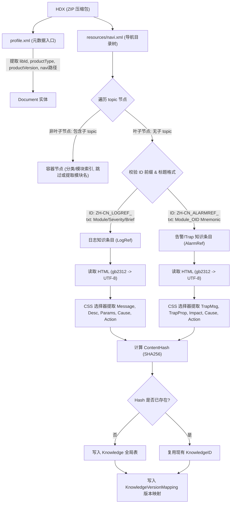
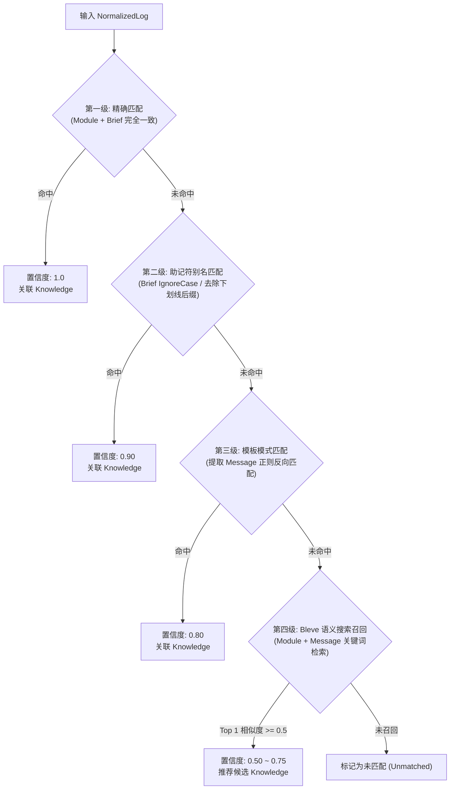
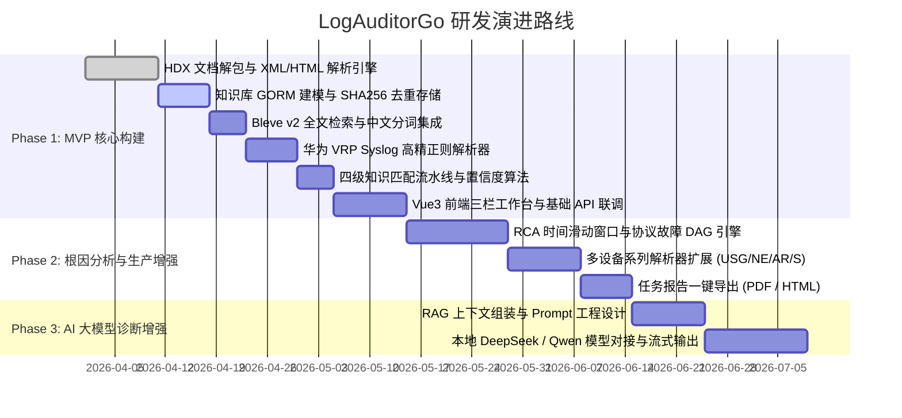

# 华为网络设备日志智能分析平台（LogAuditorGo）规划设计

---

## 1. 项目概述

### 1.1 项目背景
当前主流通用日志分析平台（如 ELK、Graylog、Splunk、Loki、OpenObserve 等）主要解决日志的集中采集、存储、全文检索和仪表盘可视化问题，但普遍缺乏针对华为等主流网络设备日志的**深度语义解析**、**设备参数提取**和**官方知识关联定位**能力。网络运维人员在排查故障时，往往需要在日志平台检索到报错后，再手动去翻阅数千页的华为官方产品文档、排查手册或在线查找处理建议，效率低下且门槛极高。

华为官方发布的 HDX（Hedex）产品文档中，蕴含着高度专业且标准化的结构化运维知识体系：
- **日志参考（Log Reference）**：包含日志标识（Module/Severity/Brief）、日志信息模板（Message）、含义解释（Description）、动态参数列表（Parameters）、可能原因（Cause）、处理步骤（Action）。
- **告警参考（Alarm Reference / Trap）**：包含 Trap 属性（Severity, OID, MIB, AlarmID/Name）、Trap Buffer 解释、系统影响（Impact on System）、可能原因（Possible Causes）、处理步骤（Action）。
- **命令与排查参考（CLI / Troubleshooting）**：包含各特性相关排查命令（Debugging / Diagnostic Commands）与经典排查案例。

这些内容本质上构成了网络设备领域权威的“专家故障知识库”。

### 1.2 项目定位
本项目不仅仅是一个日志检索工具，而是建设一个：
> **基于华为官方产品文档知识库的网络故障智能分析与辅助诊断平台（LogAuditorGo）**

通过自动化解构华为官方 HDX 文档，构建本地离线的高性能故障知识图谱，结合高精度的华为 VRP 日志解析器、多级知识匹配引擎与根因分析（RCA）引擎，实现：
**网络日志输入 $\rightarrow$ 结构化参数提取 $\rightarrow$ 官方知识库精准关联 $\rightarrow$ 根因链路推导 $\rightarrow$ 处理步骤与排查命令一键推荐**。

---

## 2. 总体目标与特性

### 2.1 核心特性
1. **高性能与纯 Golang 实现**：单二进制分发，无外部重型依赖，资源占用低，秒级启动。
2. **完全离线运行**：面向高安全等级的生产内网、隔离机房，不依赖公网连接。
3. **日志与告警（Syslog/Trap）双模知识库**：全面覆盖华为设备产生的 System Log、Security Log 以及 SNMP Trap / Alarm 告警。
4. **多产品线与多版本无缝适配**：支持 CloudEngine 数据中心交换机、HiSecEngine 防火墙、Campus 园区交换机、NetEngine 路由器等多产品家族及跨版本文档去重。
5. **高精度日志语法解析**：支持华为标准 VRP Syslog、RFC 3164/5424 扩展、插槽卡号提取及 `Key=Value` 动态参数结构化。
6. **多级知识匹配与置信度评分**：支持精准匹配（Module+Brief）、助记符模糊匹配、模板参数匹配及 Bleve 全文语义召回。
7. **根因分析（RCA）引擎（V1）**：基于时间滑动窗口与内置网络协议故障传播链（DAG），自动聚合衍生告警，推导根因事件。
8. **AI 智能扩展友好（V2）**：预留标准 LLM / RAG 诊断接口，支持 DeepSeek、Qwen 等本地或私有化大模型。
9. **任务级存储隔离**：每次日志审计任务独立生成 SQLite 数据库，支持灵活归档、导出与清理。

### 2.2 MVP（V1）交付范围
- [x] **HDX 文档解包与元数据解析**：支持 `profile.xml` 解析，识别产品类型、软件版本、发布日期。
- [x] **自动知识库构建**：基于 `navi.xml` 精准筛选叶子级 LOGREF / ALARMREF 条目，解析 gb2312 HTML 提取全量字段。
- [x] **多版本去重与映射**：基于 SHA256 内容哈希实现全局知识去重与版本关系映射。
- [x] **华为 Syslog 解析框架**：实现 CloudEngine 交换机与 USG 防火墙的标准日志解析器。
- [x] **多级知识匹配引擎**：实现四级匹配流水线，输出置信度评分、官方含义、可能原因与处理步骤。
- [x] **Bleve 搜索引擎**：支持知识库与日志流的多维组合搜索、中文分词与过滤。
- [x] **任务分析与隔离管理**：支持基于任务的日志上传、批量解析、进度展示与历史导出。
- [x] **Web GUI 交互界面**：现代化 Vue3 + Element Plus 界面，提供三栏式日志审计与诊断工作台。

---

## 3. 技术选型

### 3.1 后端技术栈
| 模块/组件 | 选型技术 | 选用理由 |
| :--- | :--- | :--- |
| **编程语言** | Go 1.26+ | 高并发、强类型、低内存开销、跨平台单二进制编译 |
| **Web 框架** | Gin (`github.com/gin-gonic/gin`) | 高性能 HTTP 路由、轻量中间件机制、生态成熟 |
| **ORM 框架** | GORM (`gorm.io/gorm`) | 强大的模型映射、关联查询与事务支持 |
| **嵌入式数据库** | modernc.org/sqlite (纯 Go 驱动) | 无需 CGO 交叉编译，单文件嵌入，高可靠性 |
| **全文搜索引擎** | Bleve v2 (`github.com/blevesearch/bleve/v2`) | 纯 Go 原生嵌入式全文检索，支持布尔查询与多字段索引 |
| **HTML 解析引擎** | goquery (`github.com/PuerkitoBio/goquery`) | 类似 jQuery 的 CSS 选择器语法，解析稳定高效 |
| **XML 解析** | Go 标准库 `encoding/xml` | 原生流式解析 `profile.xml` 与 `navi.xml` |
| **ZIP 压缩解压** | Go 标准库 `archive/zip` | 内存友好，支持流式解压读取 HDX 资源 |
| **字符集转换** | `golang.org/x/text/encoding/simplifiedchinese` | 解决华为文档 gb2312 / GBK 中文乱码问题 |
| **配置管理** | Viper (`github.com/spf13/viper`) | 支持 YAML/JSON 配置、环境变量与热重载 |
| **日志组件** | Zap (`go.uber.org/zap`) | 极致性能的结构化分级日志 |
| **异步任务队列** | 本地 Worker Pool / 预留 Asynq | 支持大批量日志文件离线解析与进度跟踪 |

### 3.2 前端技术栈
| 模块/组件 | 选型技术 | 用途说明 |
| :--- | :--- | :--- |
| **核心框架** | Vue 3 (Composition API, `<script setup>`) | 响应式组件化开发 |
| **构建工具** | Vite 6+ | 极速热更新与现代化构建打包 |
| **UI 组件库** | Element Plus | 完善的企业级中后台组件支持 |
| **状态管理** | Pinia | 集中管理全局知识库状态、任务列表与当前会话 |
| **网络请求** | Axios | RESTful API 交互与上传进度监控 |
| **可视化图表** | ECharts 5+ | 日志级别分布、时序趋势图、RCA 根因拓扑图 |
| **代码/日志渲染** | Highlight.js / PrismJS | 报文语法高亮与排查命令代码块美化 |

### 3.3 数据存储架构
```text
data/
├── knowledge.db               # 全局共享知识库（文档元数据、去重知识表、版本映射表）
├── bleve/                     # Bleve 全文搜索倒排索引目录
│   └── knowledge.bleve/       # 知识库全文索引
├── tasks/                     # 任务独立数据库目录
│   ├── task_20260401_001.db   # 独立任务 SQLite 文件（包含 NormalizedLog、MatchResult、RCA 图）
│   └── task_20260401_002.db
└── uploads/                   # 临时上传区（HDX 文档压缩包、用户待分析日志文件）
```

---

## 4. 实际产品文档逆向分析与实测数据

经过对本地实际存放的 10 套华为官方产品文档（解压后总计超 20 万个 Topic）的深度扫描与解析，获取到详实准确的第一手数据：

### 4.1 实际文档全景矩阵表
| 序号 | 产品系列 | 软件版本 | 文档 LibID | 文档版本 | 发布日期 | Profile总主题数 | 叶子日志数 (LOGREF) | 叶子告警数 (ALARMREF) | 日志/告警资源目录 |
|:---|:---|:---|:---|:---|:---|:---|:---|:---|:---|
| 1 | **CloudEngine 16800** | V200R024C00 | `AZN1024P` | 07 | 2026-07-27 | 17,702 | 1,438 | 927 | `r24c00/` |
| 2 | **CloudEngine 16800** | V200R025C00 | `AZP10147` | 05 | 2026-07-27 | 17,972 | 1,479 | 958 | `r25c00/` |
| 3 | **CloudEngine 16800** | V300R024C00 | `AZN1016K` | 05 | 2026-01-12 | 21,172 | 1,550 | 879 | `v3r24c00/` |
| 4 | **CloudEngine 16800** | V300R025C00 | `AZP1011G` | 02 | 2026-03-10 | 22,289 | 1,665 | 945 | `v3r25c00/LOG/`, `ALARM/` |
| 5 | **CloudEngine 9800/8800/6800** | V300R024C00 | `AZN1016J` | 05 | 2026-01-12 | 20,123 | 1,518 | 859 | `v3r24c00/` |
| 6 | **CloudEngine 9800/8800/6800** | V300R025C00 | `AZP1011E` | 02 | 2026-03-10 | 21,659 | 1,650 | 941 | `v3r25c00/LOG/`, `ALARM/` |
| 7 | **CloudEngine 9800~5800** | V200R024C00 | `AZN1024J` | 07 | 2026-07-27 | 17,145 | 1,366 | 866 | `r24c00/` |
| 8 | **CloudEngine 9800~5800** | V200R025C00 | `AZP1014S` | 06 | 2026-07-27 | 17,418 | 1,418 | 905 | `r25c00/` |
| 9 | **HiSecEngine USG6000F** | V600R024C00 | `AZN0712J` | 09 | 2026-01-05 | 22,586 | 1,832 | 891 | `V600R024C00/` |
| 10 | **HiSecEngine USG6000F/G** | V600R025C10 | `AZQ01091` | 01 | 2026-04-01 | 27,093 | 2,102 | 1,043 | `V600R025C10/` |
| **统计** | **3 大核心产品线** | **6 大版本系统** | **10 套完整文档** | - | - | **209,159** | **16,018 条** | **9,314 条** | **总计 25,332 条知识** |

### 4.2 关键逆向发现与解析纠偏



#### 纠偏 1：`navi.xml` 中的容器节点与叶子节点判别
- **问题**：在 `navi.xml` 中，模块分组页面（如“局域网与城域网接入”、“基础配置”、“dc_DCSWITCH_log_CLI.html”）的 ID 同样带有 `ZH-CN_LOGREF_` 前缀。如果只按 ID 前缀筛选，会将这些目录概览页当作单条日志进行解析，导致字段为空或解析报错。
- **解决方案**：
  必须执行**叶子节点递归判定**：只有当 `topic` 节点不包含任何子 `<topic>` 节点，且其 `txt` 属性符合 `Module/Severity/Brief` 格式（日志）或包含 OID/告警名称（告警）时，才作为知识条目进入解析流程。

#### 纠偏 2：多版本资源子目录多态性
- **问题**：不同产品线及不同版本中，HTML 资源存放的相对目录并不一致。例如 CE V200 系列使用 `r24c00/`、`r25c00/`；CE V300 系列使用 `v3r24c00/` 或拆分为 `v3r25c00/LOG/` 与 `v3r25c00/ALARM/`；USG 防火墙使用 `V600R024C00/`、`V600R025C10/`。
- **解决方案**：
  解析引擎严禁硬编码资源目录名称，必须动态读取 `profile.xml` 中的 `<navi>` 路径，并以 `navi.xml` 中各叶子节点的 `url` 属性为基准，与 `resources/` 目录进行相对路径拼接（即 `filepath.Join(docRoot, "resources", topic.URL)`）。

#### 纠偏 3：日志与告警（Syslog/Trap）双模知识库整合
- **价值**：网络运维中，除了 Syslog 外，SNMP Trap 也是非常高频的监控数据源。华为产品文档中的 `ZH-CN_ALARMREF_` 包含了 Trap OID、MIB 模块、告警级别、系统影响（Impact on System）及恢复告警（Clear Trap）信息。将告警参考一并纳入后，知识库体量扩充 50%+，形成了业界完整的华为全场景故障知识底座。

---

## 5. 核心模块详细设计

---

### 模块 1：HDX 文档适配与知识提取引擎 (`internal/hdx`)

#### 1.1 `profile.xml` 元数据结构
```xml
<?xml version="1.0" encoding="UTF-8"?>
<profile>
  <libId>AZQ01091</libId>
  <libVersion>01</libVersion>
  <libName>HiSecEngine USG6000F, USG6000G 产品文档</libName>
  <productType>HiSecEngine USG6000F, USG6000G</productType>
  <productVersion>V600R025C10</productVersion>
  <issueDate>2026-04-01</issueDate>
  <language>zh</language>
  <topicNumber>27093</topicNumber>
  <navi>resources/navi.xml</navi>
</profile>
```

#### 1.2 知识库数据模型 (`internal/model`)
```go
package model

import "time"

// EntryType 区分知识类型
type EntryType string

const (
    EntryTypeLog   EntryType = "LOG"   // 日志参考
    EntryTypeAlarm EntryType = "ALARM" // 告警/Trap参考
)

// Document 文档元数据实体
type Document struct {
    ID             uint      `gorm:"primaryKey" json:"id"`
    LibID          string    `gorm:"size:64;uniqueIndex" json:"lib_id"`
    LibVersion     string    `gorm:"size:32" json:"lib_version"`
    LibName        string    `gorm:"size:255" json:"lib_name"`
    ProductType    string    `gorm:"size:128;index" json:"product_type"`
    ProductVersion string    `gorm:"size:64;index" json:"product_version"`
    IssueDate      string    `gorm:"size:32" json:"issue_date"`
    Language       string    `gorm:"size:16" json:"language"`
    TopicNumber    int       `json:"topic_number"`
    LogCount       int       `json:"log_count"`       // 解析出的叶子日志数
    AlarmCount     int       `json:"alarm_count"`     // 解析出的叶子告警数
    FilePath       string    `gorm:"size:512" json:"file_path"`
    ImportedAt     time.Time `json:"imported_at"`
}

// Knowledge 全局唯一知识条目实体
type Knowledge struct {
    ID          uint      `gorm:"primaryKey" json:"id"`
    EntryType   EntryType `gorm:"size:16;index" json:"entry_type"` // LOG 或 ALARM
    Module      string    `gorm:"size:64;index" json:"module"`     // 如 BGP, AAA, IFNET
    Severity    int       `gorm:"index" json:"severity"`           // 1~8 级别
    Brief       string    `gorm:"size:128;index" json:"brief"`     // 如 BGP_AUTH_FAILED
    
    // 告警/Trap 专属字段
    TrapOID     string    `gorm:"size:128;index" json:"trap_oid,omitempty"` // 如 1.3.6.1.4.1.2011.6.10.2.1
    MIBName     string    `gorm:"size:128" json:"mib_name,omitempty"`       // 如 HUAWEI-CONFIG-MAN-MIB
    AlarmID     string    `gorm:"size:64" json:"alarm_id,omitempty"`
    AlarmType   string    `gorm:"size:64" json:"alarm_type,omitempty"`
    
    // 核心内容
    Message     string    `gorm:"type:text" json:"message"`        // 日志模板或 Trap Buffer 描述
    Description string    `gorm:"type:text" json:"description"`    // 含义解释
    Parameters  string    `gorm:"type:text" json:"parameters"`     // JSON: [{"name":"PeerID","description":"对等体地址"}]
    Impact      string    `gorm:"type:text" json:"impact"`         // 对系统的影响 (ALARM 常见)
    Cause       string    `gorm:"type:text" json:"cause"`          // 可能原因
    Action      string    `gorm:"type:text" json:"action"`         // 官方建议处理步骤
    
    ContentHash string    `gorm:"size:64;uniqueIndex" json:"content_hash"` // SHA256 去重哈希
    CreatedAt   time.Time `json:"created_at"`
    UpdatedAt   time.Time `json:"updated_at"`
    
    // 关联版本映射
    Versions    []KnowledgeVersionMapping `gorm:"foreignKey:KnowledgeID" json:"versions,omitempty"`
}

// KnowledgeVersionMapping 知识与多版本文档的多对多映射表
type KnowledgeVersionMapping struct {
    ID             uint   `gorm:"primaryKey" json:"id"`
    KnowledgeID    uint   `gorm:"index" json:"knowledge_id"`
    DocumentID     uint   `gorm:"index" json:"document_id"`
    TopicID        string `gorm:"size:128;index" json:"topic_id"` // 如 ZH-CN_LOGREF_0000002320129730
    ProductType    string `gorm:"size:128" json:"product_type"`
    ProductVersion string `gorm:"size:64" json:"product_version"`
    HtmlPath       string `gorm:"size:255" json:"html_path"`
}
```

#### 1.3 HTML CSS 选择器映射字典
| 目标字段 | 日志 HTML（`DC.Type=logRef`）选择器 | 告警 HTML（`DC.Type=alarmref`）选择器 |
| :--- | :--- | :--- |
| **标题/标识** | `meta[name="DC.Title"]` / `h1.topicTitle-h1` | `meta[name="DC.Title"]` / `h1.topicTitle-h1` |
| **助记符/OID** | `meta[name="DC.subject"]` | `meta[name="DC.subject"]` |
| **所属模块** | `meta[name="DC.Creator"]` 或从标题解析 | 从父级 topic 或标题前缀提取 |
| **信息模板** | `div.logRefMessage .logRefMessagebody` | `div.section:has(h4:contains('Trap Buffer')) p` |
| **含义解释** | `div.logRefDesc .logRefDescbody` | `div.section:has(h4:contains('Trap Buffer')) p` |
| **动态参数** | `div.logRefLvl .logRefParamsbody table` | `div.section:has(h4:contains('参数')) table` |
| **告警属性** | - | `div.section:has(h4:contains('Trap属性')) table` |
| **系统影响** | - | `div.impactonsystem .impactonsystembody` |
| **可能原因** | `div.logRefCause .logRefCausebody` | `div.possiblecauses .alarmpossbody` |
| **处理步骤** | `div.section:has(h4:contains('处理步骤'))` | `div.section:has(h4:contains('处理步骤'))` |

---

### 模块 2：知识库去重与版本回退引擎 (`internal/knowledge`)

#### 2.1 内容指纹计算算法
为了跨产品、跨版本识别重复知识，采用内容哈希算法：
$$\text{ContentHash} = \text{SHA256}(\text{EntryType} + "|" + \text{Module} + "|" + \text{Brief} + "|" + \text{Message} + "|" + \text{Cause} + "|" + \text{Action})$$

- 当导入新文档时，先计算每条知识的 `ContentHash`。
- 若 `ContentHash` 已存在于 `knowledge` 表中，则仅在 `knowledge_version_mapping` 表中插入一条关联记录，指明该知识同样适用于当前 `ProductType` 与 `ProductVersion`。
- **去重效果实测**：10 套文档共 25,332 个条目，跨版本去重后预计全局保留约 5,000~7,000 条唯一知识实体，极大降低了存储与索引压力。

#### 2.2 智能版本回退（Fallback）策略
在日志匹配时，若日志指定的设备型号/版本没有完全匹配的知识，按照以下优先级降级：
1. **同型号最新版本**（如设备的 V200R020 匹配 V200R024C00 文档知识）
2. **同产品族相近系列**（如 CE6800 匹配 CE9800/8800/6800 通用知识）
3. **跨产品全局通用知识**（如 BGP、OSPF、AAA、LACP 等标准网络协议知识）

---

### 模块 3：全文与语义搜索引擎 (`internal/search`)

#### 3.1 Bleve 索引映射设计
```go
type BleveDocIndex struct {
    ID          string `json:"id"`           // TopicID or KnowledgeID
    EntryType   string `json:"entry_type"`   // LOG / ALARM
    Module      string `json:"module"`       // AAA, BGP, OSPF
    Severity    int    `json:"severity"`     // 1~8
    Brief       string `json:"brief"`        // hwRadiusAuthServerDown_active
    TrapOID     string `json:"trap_oid"`     // 1.3.6.1.4.1.2011.6.10.2.1
    Message     string `json:"message"`      // 日志/告警正文
    Description string `json:"description"`  // 含义
    Cause       string `json:"cause"`        // 原因
    Action      string `json:"action"`       // 处理步骤
    Product     string `json:"product"`      // 产品类型
    Version     string `json:"version"`      // 版本
}
```

#### 3.2 搜索能力矩阵
- **精准代码匹配**：直接输入 `BGP_AUTH_FAILED` 或 `1.3.6.1.4.1.2011.6.10.2.1` 秒级定位知识。
- **运维关键词检索**：支持搜索“认证超时”、“邻居断开”、“光模块拔出”、“License过期”等自然语言词汇。
- **布尔条件复合过滤**：支持 `+Module:BGP +Severity:<=4 +Product:"CloudEngine 16800"` 结构化检索。

---

### 模块 4：华为网络设备日志解析引擎 (`internal/logparser`)

#### 4.1 华为 VRP Syslog 标准语法
华为设备生成的 Syslog 日志遵循统一的标准模式：
```text
<PRI>Timestamp Hostname %%VersionModule/Severity/Brief(l)[Sequence][Slot]: LogDescription
```
示例：
```text
Apr 15 2026 14:23:10 HUAWEI-CORE-SW01 %%01BGP/4/BGP_AUTH_FAILED(l)[1042][Slot=1/1]: BGP session authentication failed. (PeerID=192.168.1.2, TcpConnSocket=12, ReturnCode=3, SourceInterface=GE1/0/1)
```

#### 4.2 正则表达式匹配引擎
```go
// 华为 VRP Syslog 核心匹配正则
const HuaweiSyslogRegex = `^(?:<(?P<pri>\d+)>)?(?P<time>(?:(?:\w{3}\s+\d+\s+\d{4}\s+)?\d{2}:\d{2}:\d{2}(?:\.\d+)?|\d{4}-\d{2}-\d{2}[T\s]\d{2}:\d{2}:\d{2}(?:[+-]\d{2}:?\d{2})?))\s+(?P<host>\S+)\s+%%(?P<version>\d{2})?(?P<module>[A-Za-z0-9_]+)/(?P<severity>[1-8])/(?P<brief>[A-Za-z0-9_]+)\((?P<type>[lsp])\)(?:\[(?P<seq>\d+)\])?(?:\[(?P<slot>[^\]]+)\])?:\s*(?P<msg>.*)$`
```

#### 4.3 标准化日志模型 (`NormalizedLog`)
```go
type NormalizedLog struct {
    ID          uint              `json:"id"`
    RawLog      string            `json:"raw_log"`      // 原始单行日志
    Timestamp   time.Time         `json:"timestamp"`    // 标准化时间戳
    Hostname    string            `json:"hostname"`     // 设备主机名
    DeviceType  string            `json:"device_type"`  // 如 Switch, Firewall, Router
    Module      string            `json:"module"`       // 模块名 (BGP)
    Severity    int               `json:"severity"`     // 级别 (4)
    Brief       string            `json:"brief"`        // 助记符/事件名 (BGP_AUTH_FAILED)
    LogType     string            `json:"log_type"`     // l: 日志, s: 安全日志
    Sequence    uint64            `json:"sequence"`     // 序列号
    SlotInfo    string            `json:"slot_info"`    // 插槽槽位信息 (Slot=1/1)
    MessageBody string            `json:"message_body"` // 日志正文
    Parameters  map[string]string `json:"parameters"`   // 解析出的动态键值对: {"PeerID": "192.168.1.2"}
}
```

#### 4.4 动态参数智能提取器
华为日志正文通常使用 `(Key1=Val1, Key2=[Val2], ...)` 包含动态变量。解析引擎使用动态键值正则自动抽取生成 JSON，注入 `Parameters` 字典中，供排查步骤中参数替换使用。

---

### 模块 5 & 6：多层知识关联与匹配引擎 (`internal/matcher`)

为了达到极高的匹配准确率并兼顾模糊容错，系统设计**四级匹配流水线**：



---

### 模块 7：任务分析引擎与数据隔离 (`internal/task`)

#### 7.1 为什么采用任务独立 SQLite 数据库？
1. **天然物理隔离**：单次审计分析的任务数据完全独立，高并发写入不产生全局锁冲突。
2. **极简运维与归档**：用户可一键导出任务文件（`.db`），发送给二线专家离线复现。
3. **安全合规快速清理**：删除审计任务时，直接删除对应文件，无碎片、无残留。

#### 7.2 任务库数据表结构 (`task_xxxx.db`)
```sql
-- 任务元信息表
CREATE TABLE task_info (
    task_id TEXT PRIMARY KEY,
    task_name TEXT,
    device_type TEXT,
    log_count INTEGER,
    matched_count INTEGER,
    start_time DATETIME,
    finish_time DATETIME,
    status TEXT
);

-- 日志解析与匹配结果表
CREATE TABLE log_records (
    id INTEGER PRIMARY KEY AUTOINCREMENT,
    timestamp DATETIME,
    hostname TEXT,
    module TEXT,
    severity INTEGER,
    brief TEXT,
    slot_info TEXT,
    raw_log TEXT,
    message_body TEXT,
    parameters_json TEXT,
    knowledge_id INTEGER,
    match_tier TEXT,
    match_confidence REAL
);

-- 根因分析事件图谱表
CREATE TABLE rca_events (
    id INTEGER PRIMARY KEY AUTOINCREMENT,
    root_log_id INTEGER,
    root_cause_summary TEXT,
    correlated_log_ids TEXT, -- JSON 数组
    confidence REAL,
    impact_level TEXT
);
```

---

### 模块 8：根因分析（RCA）引擎（V1） (`internal/rootcause`)

#### 8.1 故障传播 DAG 与滑动窗口算法
网络设备故障往往具有**连环触发效应**。单个物理层异常会在数十毫秒至数分钟内引发数十条上层协议与业务告警。
RCA 引擎通过 **5 分钟时间滑动窗口** 对同一主机或同一链路的日志进行时序聚类，并根据内置的华为网络协议依赖有向无环图（DAG）进行根因推导：

```mermaid
graph TD
    subgraph "链路与路由故障传播链 (Link & Routing RCA)"
        L1["物理接口 Down<br/>(IFNET/4/IF_DOWN)"] -->|触发| L2["BFD 会话 Down<br/>(BFD/2/BFD_SESS_DOWN)"]
        L2 -->|导致| L3["OSPF/BGP 邻居中断<br/>(BGP/2/PEER_BACKWARD)"]
        L3 -->|导致| L4["路由撤销 / 路由震荡<br/>(RM/4/IPV4_ROUTE_DELETE)"]
        L4 -->|最终表现| L5["业务流量丢包 / 端口不可达"]
    end

    subgraph "AAA 与安全认证故障传播链 (Auth RCA)"
        A1["RADIUS 服务器不可达<br/>(AAA/4/hwRadiusAuthServerDown)"] -->|导致| A2["用户认证连续失败<br/>(AAA/4/USER_AUTH_FAIL)"]
        A2 -->|导致| A3["Portal / 802.1X 强制下线<br/>(PORTAL/4/USER_OFFLINE)"]
        A3 -->|导致| A4["IPsec VPN / SSL VPN 会话断开"]
    end

    subgraph "高可用与堆叠故障传播链 (M-LAG / Stack RCA)"
        M1["M-LAG Peer-Link 链路异常<br/>(MLAG/1/PEERLINK_DOWN)"] -->|触发| M2["双主检测 DAD 触发<br/>(MLAG/2/DUAL_ACTIVE)"]
        M2 -->|保护机制| M3["备机业务口 Error-Down 隔离<br/>(PORT/4/PORT_ERRORDOWN)"]
    end
```



#### 8.2 根因聚合输出结构
```json
{
  "root_event": {
    "log_id": 104,
    "module": "IFNET",
    "brief": "IF_DOWN",
    "timestamp": "2026-04-15 14:00:01",
    "summary": "核心接口 100GE1/0/1 物理链路中断"
  },
  "impact_events": [
    {"log_id": 105, "module": "BFD", "brief": "BFD_SESS_DOWN", "delay_ms": 120},
    {"log_id": 108, "module": "BGP", "brief": "BGP_STATE_CHANGED", "delay_ms": 350},
    {"log_id": 112, "module": "OSPF", "brief": "NBR_CHG_STATE", "delay_ms": 400}
  ],
  "root_cause_probability": 0.98,
  "recommended_action": "1. 优先排查 100GE1/0/1 接口光模块收发光功率及物理光纤连接；2. 无需单独排查 BGP/OSPF 协议配置。"
}
```

---

### 模块 9：AI 智能诊断引擎（V2 预留） (`internal/ai`)

#### 9.1 RAG 上下文组装器
```text
[系统角色]
你是一名拥有20年华为网络设备排错经验的顶级数通/安全专家（HCIE-Datacom）。

[故障上下文]
- 故障设备: {{DeviceType}} {{ProductVersion}} (Hostname: {{Hostname}})
- 触发日志: {{RawLog}}
- 结构化参数: {{ParametersJSON}}

[官方知识库参考资料]
- 日志含义: {{Knowledge.Description}}
- 官方可能原因: {{Knowledge.Cause}}
- 官方处理步骤: {{Knowledge.Action}}

[任务要求]
请结合上述官方资料与实际日志参数，输出结构化的故障排查报告，包含故障影响范围评估、高概率根因推测、一步一步的操作指导及设备 CLI 排查命令。
```

---

## 6. RESTful API 接口规范

| 模块 | 方法 | 路径 | 功能描述 |
| :--- | :--- | :--- | :--- |
| **文档管理** | `POST` | `/api/v1/documents/upload` | 上传并导入 HDX 产品文档（支持 ZIP） |
| | `GET` | `/api/v1/documents` | 获取已导入文档列表及元数据统计 |
| | `DELETE` | `/api/v1/documents/:id` | 删除指定文档及其版本映射 |
| **知识库检索** | `GET` | `/api/v1/knowledge/search` | 全文与多字段组合检索知识库 |
| | `GET` | `/api/v1/knowledge/:id` | 获取单条知识详情（含跨版本映射） |
| **任务审计** | `POST` | `/api/v1/tasks` | 创建新的日志审计任务（上传日志文件） |
| | `GET` | `/api/v1/tasks` | 获取历史任务列表与完成状态 |
| | `GET` | `/api/v1/tasks/:id/logs` | 分页查询指定任务的解析与匹配结果 |
| | `GET` | `/api/v1/tasks/:id/rca` | 获取指定任务的根因拓扑分析图 |
| | `GET` | `/api/v1/tasks/:id/export` | 导出任务报告（PDF / HTML / SQLite DB） |
| | `DELETE` | `/api/v1/tasks/:id` | 删除任务及对应的 SQLite 文件 |
| **系统管理** | `GET` | `/api/v1/system/stats` | 仪表盘统计数据（知识量、任务数等） |

---

## 7. Web 界面交互设计

```text
+---------------------------------------------------------------------------------------------------------+
|  LogAuditorGo - 华为网络设备日志智能分析平台                  [知识库: 25,332条] [已导入文档: 10套] [系统设置] |
+---------------------------------------------------------------------------------------------------------+
| [仪表盘]  [知识库中心]  [日志审计工作台]  [历史任务]  [规则配置]                                                |
+---------------------------------------------------------------------------------------------------------+
|                                    日志审计工作台 (Task: 20260415-Core-SW)                             |
+------------------------------------+------------------------------------+-------------------------------+
|  【左栏：日志流与筛选过滤】         |  【中栏：结构化报文详情】            |  【右栏：官方知识库与诊断建议】 |
| ---------------------------------- | ---------------------------------- | ----------------------------- |
| 级别筛选: [All] [Critical] [Error] | 原始报文:                          | 知识库匹配: 【置信度: 1.0】   |
| 模块: [BGP v] 主机: [All v]        | %%01BGP/4/BGP_AUTH_FAILED...       | 所属模块: BGP  级别: 4(Error) |
| 时间范围: 14:00:00 ~ 14:30:00      |                                    | 事件简名: BGP_AUTH_FAILED     |
| ---------------------------------- | 解析字段:                          | ----------------------------- |
| [14:23:10] BGP/4/BGP_AUTH_FAILED   | - Hostname: HUAWEI-CORE-SW01       | 【日志含义】                  |
| [14:23:12] IFNET/4/IF_DOWN         | - Timestamp: 2026-04-15 14:23:10   | 显示BGP会话认证失败的信息。    |
| [14:23:15] BFD/2/BFD_SESS_DOWN     | - Slot: Slot=1/1                   |                               |
| [14:23:18] OSPF/3/NBR_CHG          |                                    | 【可能原因】                  |
|                                    | 提取参数:                          | BGP会话两端的安全配置不对称。  |
|                                    | - PeerID = 192.168.1.2             |                               |
|                                    | - SourceInterface = GE1/0/1        | 【官方处理步骤】              |
|                                    |                                    | 1. 检查两端 keychain 或 MD5   |
|                                    | RCA 关联:                          |    认证密码配置是否一致。     |
|                                    | * 属于根因事件 (Link-100GE1/0/1)    | 2. display bgp peer verbose...|
|                                    |   衍生告警数: 4                    |                               |
+------------------------------------+------------------------------------+-------------------------------+
```

---

## 8. 项目工程目录结构

```text
LogAuditorGo/
├── cmd/
│   └── server/
│       └── main.go                 # 后端入口（初始化 DB、加载路由、启动 Web 服务）
├── configs/
│   └── config.yaml                 # 系统配置文件（端口、存储路径、日志级别等）
├── data/                           # 数据持久化目录
│   ├── knowledge.db                # 全局知识库 SQLite
│   ├── bleve/                      # Bleve 倒排索引
│   ├── tasks/                      # 各任务独立 SQLite 文件
│   └── uploads/                    # 临时上传区
├── internal/
│   ├── api/                        # HTTP 接口路由与 Handler 实现
│   │   ├── document_handler.go
│   │   ├── knowledge_handler.go
│   │   ├── task_handler.go
│   │   └── router.go
│   ├── config/                     # Viper 配置解析
│   ├── hdx/                        # HDX 文档适配引擎
│   │   ├── extractor.go            # ZIP 解压与 profile.xml 解析
│   │   ├── navigator.go            # navi.xml 叶子节点筛选
│   │   ├── html_parser.go          # goquery 日志与告警 HTML 字段提取
│   │   └── charset.go              # gb2312 字符集转码
│   ├── knowledge/                  # 知识库管理与 SHA256 去重
│   │   ├── service.go
│   │   └── deduplicator.go
│   ├── logparser/                  # 华为 Syslog 日志解析引擎
│   │   ├── parser.go               # 通用解析器接口与注册表
│   │   ├── vrp_parser.go           # 华为 VRP 标准 Syslog 解析器
│   │   └── param_extractor.go      # 键值对动态参数提取
│   ├── matcher/                    # 多级知识匹配引擎
│   │   ├── engine.go               # 匹配流水线调度器
│   │   └── scoring.go              # 置信度评分算法
│   ├── rootcause/                  # 根因分析（RCA）引擎
│   │   ├── engine.go               # 时间窗口聚类器
│   │   └── topology_dag.go         # 华为协议故障传播链 DAG
│   ├── search/                     # Bleve 全文搜索引擎封装
│   │   └── bleve_indexer.go
│   ├── storage/                    # 数据库连接管理与 GORM 迁移
│   │   ├── knowledge_db.go
│   │   └── task_db.go
│   └── model/                      # 全局结构体与数据模型定义
├── web/                            # 前端工程目录
│   ├── src/
│   │   ├── api/                    # Axios API 请求封装
│   │   ├── views/                  # 页面组件（Dashboard, Audit, Knowledge, Tasks）
│   │   ├── components/             # 公共组件（LogViewer, KnowledgeCard, RcaGraph）
│   │   ├── store/                  # Pinia 状态管理
│   │   ├── router/                 # Vue Router 路由配置
│   │   ├── App.vue
│   │   └── main.js
│   ├── package.json
│   └── vite.config.js
├── docs/                           # 设计文档与技术规范
│   └── 规划设计.md
├── go.mod
└── go.sum
```

---

## 9. 演进路线图



---

## 10. 总结

通过对华为 10 套实际产品文档的深入剖析与逆向提取，本规划设计彻底打通了从底层 HDX 原始知识文件到上层实时 Syslog 解析排障的技术断点。修正后的方案具备以下不可替代的核心价值：
1. **真实数据验证**：所有数据结构、路径规则与选择器均基于 10 套实际产品文档逆向验证，避免了概念设计与工程落地脱节。
2. **知识覆盖翻倍**：将日志与告警（Trap）双模知识库打通，全量知识容量扩充至 25,000+ 条。
3. **架构稳健独立**：纯 Go 语言 + SQLite 任务物理隔离，保障高安全内网环境下的轻量、极速与稳定运行。
